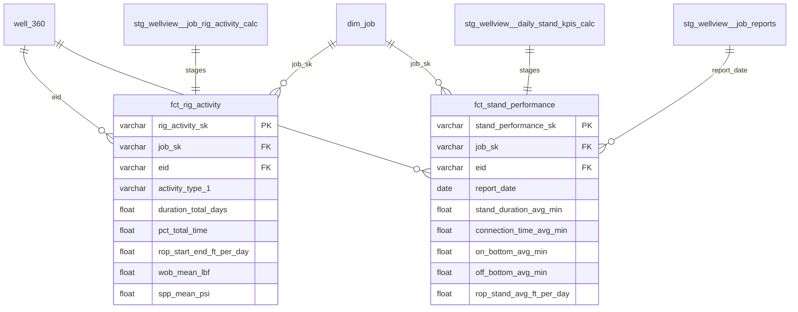

# Drilling Mart Sprint 3: Rig Activity & Stand KPIs

## Enhancement Summary

**Deepened on:** 2026-02-14
**Sections enhanced:** 4 (fct_stand_performance, fct_rig_activity, source YAML, YAML schema)
**Research agents used:** architecture-strategist, performance-oracle, data-integrity-guardian, pattern-recognition-specialist, learnings-researcher, best-practices-researcher

### Key Corrections (from deepening review)

1. **FIXED: Remove `current_date()` fallback** — `fct_stand_performance.report_date` now uses `sk.start_date::date` (source timestamp) instead of non-deterministic `current_date()`. Matches Sprint 2 pattern.
2. **FIXED: Remove clustering** — `fct_stand_performance` at 50-100K rows is below the project's <100K clustering threshold. Removed `cluster_by`.
3. **FIXED: Guard hash-of-NULL** — `job_sk` in `fct_stand_performance` now uses `case when jr.job_id is not null then generate_surrogate_key(...) end` to prevent garbage keys when report join fails.
4. **FIXED: Hard `not_null` on natural keys** — `job_id` and `well_id` use hard `not_null` (no `severity: warn`) to match Sprint 2 pattern.
5. **Added: Duration unit documentation** — drilling mart uses hours (Sprint 2), days (fct_rig_activity), and minutes (fct_stand_performance). Each unit matches the natural grain. Documented in YAML descriptions.
6. **Added: Post-build grain validation** — acceptance criteria includes grain assertion checks for both fact tables.

## Overview

Stage two WellView calc tables (`wvJRigActivityCalc`, `wvJRStandCalc`) and build two fact tables (`fct_rig_activity`, `fct_stand_performance`) that answer: **"What were the sensor-derived rig states?"** and **"How fast are we making connections and drilling stands?"**

These are the first calc-table-sourced facts in the drilling mart. Calc tables contain sensor-derived metrics that are impractical to rebuild from raw data — WellView pre-computes them from WITS/WITSML sensor feeds.

**Prior art:** Sprint 1 built 4 dimensions + `fct_daily_drilling_cost` (incremental, 1.9M rows). Sprint 2 built `fct_drilling_time` (762K rows) + `fct_npt_events` (14K rows). All patterns are documented in `docs/solutions/refactoring/`.

## Deliverables

| # | Model | Type | Materialization | Source |
|---|-------|------|----------------|--------|
| 1 | `stg_wellview__job_rig_activity_calc` | Staging | view | `wvJRigActivityCalc` (CALC schema) |
| 2 | `stg_wellview__daily_stand_kpis_calc` | Staging | view | `wvJRStandCalc` (CALC schema) |
| 3 | `fct_rig_activity` | Fact | table | Staging #1 + well_360 + dim_job |
| 4 | `fct_stand_performance` | Fact | table | Staging #2 + well_360 + dim_job |

**No intermediates needed.** Both facts have simple enrichment (1-2 lookups + inline surrogate keys), fitting the "skip intermediate" pattern from Sprint 2.

## Technical Approach

### Source Tables

Both tables live in the `FORMENTERAOPS_WV120_CALC` schema (already configured as `wellview_calcs` source in `operations/_src_wellview.yml`).

**`wvJRigActivityCalc`** — Sensor-derived rig activity states at job grain
- **Grain:** 1 row per (job, activity_type_1). Multiple rows per job.
- **Parent:** IDRecParent = Job IDRec. IDWELL = Well GUID.
- **Key columns:** Typ1, Duration (days), DurOnBtm/OffBtm/PipeMoving (days), DepthStart/End (m), ROPStartEnd (m/day), WOB/RPM/SPP/Torque/HookLoad/FlowRate (mean/max/min/stddev), Count
- **Unit conversions needed:** depths (m→ft), ROP (m/day→ft/day), WOB/HookLoad (N→lbf), SPP (kPa→psi), Torque (N·m→ft·lb), FlowRate (m³/day→bbl/day)

**`wvJRStandCalc`** — Stand KPI summary at daily report grain
- **Grain:** 1 row per daily report. One summary row with statistics.
- **Parent:** IDRecParent = Daily Report IDRec. IDWELL = Well GUID.
- **Key columns:** DurStand/Connect/OnBtm/OffBtm/PipeMoving/SlipToSlip/SlipToWt/WtToSlip/WtToWt (avg/min/max/med/stddev each), ROPStand/ROPOnBtm (avg/max/min/med/stddev each)
- **Unit conversions needed:** durations (days→minutes), ROP (m/day→ft/day)

### Model 1: `stg_wellview__job_rig_activity_calc`

**File:** `models/operations/staging/wellview/operations/stg_wellview__job_rig_activity_calc.sql`

5-CTE pattern. Key decisions:

```
source  → dedup on IDRec by _fivetran_synced desc
renamed → snake_case, type cast, unit conversions via wv_* macros
          - {{ wv_meters_to_feet('DepthStart') }} as depth_start_ft
          - {{ wv_meters_to_feet('DepthEnd') }} as depth_end_ft
          - {{ wv_meters_to_feet('ROPStartEnd') }} as rop_start_end_ft_per_day
          - {{ wv_newtons_to_lbf('WOB') }} as wob_mean_lbf
          - {{ wv_kpa_to_psi('SPP') }} as spp_mean_psi
          - {{ wv_nm_to_ft_lb('Torque') }} as torque_mean_ft_lb
          - {{ wv_newtons_to_lbf('HookLoad') }} as hook_load_mean_lbf
          - {{ wv_cbm_per_day_to_bbl_per_day('LiquidInjRate') }} as flow_rate_mean_bbl_per_day
          - Duration columns stay in days (natural grain for job-level activity)
filtered → remove soft deletes + null IDRec
enhanced → surrogate key on IDRec, _loaded_at
final    → explicit column list, logically grouped
```

**Tags:** `['wellview', 'staging', 'operations']`

**YAML:** Full column docs in `operations/_stg_wellview.yml`. Add source table to `operations/_src_wellview.yml`.

### Model 2: `stg_wellview__daily_stand_kpis_calc`

**File:** `models/operations/staging/wellview/operations/stg_wellview__daily_stand_kpis_calc.sql`

5-CTE pattern. Key decisions:

```
source  → dedup on IDRec by _fivetran_synced desc
renamed → snake_case, type cast, unit conversions
          - All duration columns: {{ wv_days_to_minutes('DurStand') }} as stand_duration_avg_min
          - ROP columns: {{ wv_meters_to_feet('ROPStand') }} as rop_stand_avg_ft_per_day
          - 55 domain columns total (11 KPI groups × 5 stats each)
filtered → remove soft deletes + null IDRec
enhanced → surrogate key on IDRec, _loaded_at
final    → explicit column list
```

**Tags:** `['wellview', 'staging', 'operations']`

**YAML:** Full column docs. Add source table to `operations/_src_wellview.yml`.

### Model 3: `fct_rig_activity`

**File:** `models/operations/marts/drilling/fct_rig_activity.sql`

Follows `fct_npt_events` pattern (simple staging → mart, no intermediate):

```sql
config(materialized='table', tags=['drilling', 'mart', 'fact'])

CTEs:
  rig_activity → ref('stg_wellview__job_rig_activity_calc')
  well_360     → ref('well_360') where wellview_id is not null
  enriched     → join rig_activity to well_360 on well_id = wellview_id
               → inline surrogate key: generate_surrogate_key(['ra.job_id']) as job_sk
               → columns: rig_activity_sk, job_sk, eid, job_id, well_id,
                          activity_type_1, duration_total_days, pct_total_time,
                          duration_on_bottom_days, duration_off_bottom_days,
                          duration_pipe_moving_days, depth_start_ft, depth_end_ft,
                          rop_start_end_ft_per_day, occurrence_count,
                          wob_mean/max/min/stddev_lbf, rpm_mean/max/min/stddev,
                          spp_mean/max/min/stddev_psi, torque_mean/max/min_ft_lb,
                          flow_rate_mean/max/min_bbl_per_day, hook_load_mean/max/min_lbf,
                          _loaded_at
  final        → explicit column list
```

**Materialization:** `table` (estimated ~50K rows — well under incremental threshold)
**Clustering:** None (too small to benefit)
**No phase_sk:** Rig activity is job-level, not phase-level.

### Model 4: `fct_stand_performance`

**File:** `models/operations/marts/drilling/fct_stand_performance.sql`

Follows same pattern, but needs report_date from job_reports join:

```sql
config(materialized='table', tags=['drilling', 'mart', 'fact'])

CTEs:
  stand_kpis   → ref('stg_wellview__daily_stand_kpis_calc')
  job_reports  → ref('stg_wellview__job_reports')
                 select report_id, job_id, report_start_datetime::date as report_date
  well_360     → ref('well_360') where wellview_id is not null
  enriched     → join stand_kpis to job_reports on report_id = parent_record_id
               → join to well_360 on well_id = wellview_id
               → inline surrogate keys (with NULL guard):
                   case when jr.job_id is not null
                     then generate_surrogate_key(['jr.job_id'])
                   end as job_sk
               → fallback: coalesce(jr.report_date, sk.start_date::date) as report_date,
                           jr.report_id is null as is_report_date_inferred
               → columns: stand_performance_sk, job_sk, eid, job_id, well_id,
                          report_id, report_date, is_report_date_inferred,
                          stand_duration_avg/min/max/med/stddev_min,
                          connection_time_avg/min/max/med/stddev_min,
                          on_bottom_avg/min/max/med/stddev_min,
                          off_bottom_avg/min/max/med/stddev_min,
                          pipe_moving_avg/min/max/med/stddev_min,
                          slip_to_slip_avg/min/max/med/stddev_min,
                          slip_to_weight_avg/min/max/med/stddev_min,
                          weight_to_slip_avg/min/max/med/stddev_min,
                          weight_to_weight_avg/min/max/med/stddev_min,
                          rop_stand_avg/max/min/med/stddev_ft_per_day,
                          rop_on_btm_avg/max/min/med/stddev_ft_per_day,
                          _loaded_at
  final        → explicit column list
```

**Materialization:** `table` (estimated ~50-100K rows — only reports with stand data)
**Clustering:** None (50-100K rows is below the project's <100K clustering threshold).

### Source YAML Updates

Add two new table entries to `models/operations/staging/wellview/operations/_src_wellview.yml`:

```yaml
      - name: WVT_WVJRIGACTIVITYCALC
        description: "Rig activity by Type 1 (job-level) — sensor-derived states with duration, ROP, WOB, RPM, torque, SPP"
      - name: WVT_WVJRSTANDCALC
        description: "Stand KPIs by daily report — connection times, on/off bottom, pipe moving, ROP statistics"
```

### YAML Schema Updates

Add staging model column docs to `operations/_stg_wellview.yml` and fact table schema to `models/operations/marts/drilling/schema.yml`.

**Fact table tests (follow Sprint 2 pattern):**
- PK: `unique` + `not_null` on `*_sk` and natural key
- FK: `relationships` to `dim_job.job_sk` with `severity: warn`
- FK: `relationships` to `well_360.eid` with `severity: warn`
- Measures: `not_null` with `severity: warn` on key duration/KPI columns
- Range: `dbt_expectations.expect_column_values_to_be_between` with `min_value: 0` on durations

## Unit Conversion Reference

| Source Unit | Macro | Target Unit | Columns |
|-------------|-------|-------------|---------|
| `dbl_m_calc` | `wv_meters_to_feet()` | feet | DepthStart, DepthEnd |
| `dbl_mpd_calc` (ROP) | `wv_meters_to_feet()` | ft/day | ROPStartEnd, ROPStand, ROPOnBtm |
| `dbl_N_calc` | `wv_newtons_to_lbf()` | lbf | WOB*, HookLoad* |
| `dbl_kPa_calc` | `wv_kpa_to_psi()` | psi | SPP*, SPPDiff* |
| `dbl_calc` (torque) | `wv_nm_to_ft_lb()` | ft-lb | Torque* |
| `dbl_m3pd_calc` | `wv_cbm_per_day_to_bbl_per_day()` | bbl/day | LiquidInjRate* |
| `dbl_days_calc` | `wv_days_to_minutes()` | minutes | DurStand*, DurConnect*, DurOnBtm*, etc. |
| `dbl_days_calc` | (keep as days) | days | Duration (rig activity — job-grain natural unit) |
| `dbl_rpm_calc` | (no conversion) | RPM | RPM* |

**CRITICAL:** ROP uses `wv_meters_to_feet()` on m/day to get ft/day — this is a length conversion on the numerator, keeping the per-day denominator. Do NOT use `wv_per_meter_to_per_foot()` (rate conversion) for ROP.

## ERD



## Acceptance Criteria

- [ ] Both staging models follow 5-CTE pattern with Fivetran dedup
- [ ] All unit conversions use `wv_*` macros (no inline constants)
- [ ] Both fact tables have `job_sk` FK to `dim_job` and `eid` FK to `well_360`
- [ ] Surrogate keys computed inline (not via dim joins)
- [ ] `fct_stand_performance` has report_date via job_reports join with source-timestamp fallback + inference flag (NO `current_date()`)
- [ ] `fct_stand_performance.job_sk` uses NULL guard (`case when jr.job_id is not null`)
- [ ] `fct_stand_performance` has NO clustering (below threshold)
- [ ] Hard `not_null` (no severity:warn) on `job_id` and `well_id` in both facts
- [ ] YAML docs for all staging columns and fact table columns
- [ ] `dbt build --select +fct_rig_activity +fct_stand_performance` passes
- [ ] `dbt show` returns expected row structure and non-NULL measures
- [ ] Grain validation: `fct_rig_activity` has unique (job_id, activity_type_1); `fct_stand_performance` has unique report_id
- [ ] `sqlfluff lint` and `yamllint` pass on all new/modified files
- [ ] `dbt parse --warn-error --no-partial-parse` passes

## Validation Queries

After building, run these spot-checks:

```sql
-- Row counts for staging models
dbt show --select stg_wellview__job_rig_activity_calc --inline "select count(*) as row_count from {{ ref('stg_wellview__job_rig_activity_calc') }}"
dbt show --select stg_wellview__daily_stand_kpis_calc --inline "select count(*) as row_count from {{ ref('stg_wellview__daily_stand_kpis_calc') }}"

-- HOOEY well spot-check (EID 109181)
-- Rig activity: should have multiple activity types for HOOEY's drilling job
dbt show --inline "select activity_type_1, duration_total_days, rop_start_end_ft_per_day from {{ ref('fct_rig_activity') }} where eid = '109181' order by duration_total_days desc limit 10"

-- Stand performance: should have daily report entries for HOOEY
dbt show --inline "select report_date, stand_duration_avg_min, connection_time_avg_min from {{ ref('fct_stand_performance') }} where eid = '109181' order by report_date limit 10"
```

## File Summary

| Action | File | Notes |
|--------|------|-------|
| **Create** | `models/operations/staging/wellview/operations/stg_wellview__job_rig_activity_calc.sql` | 5-CTE staging |
| **Create** | `models/operations/staging/wellview/operations/stg_wellview__daily_stand_kpis_calc.sql` | 5-CTE staging |
| **Create** | `models/operations/marts/drilling/fct_rig_activity.sql` | Fact table |
| **Create** | `models/operations/marts/drilling/fct_stand_performance.sql` | Fact table |
| **Edit** | `models/operations/staging/wellview/operations/_src_wellview.yml` | Add 2 calc table sources |
| **Edit** | `models/operations/staging/wellview/operations/_stg_wellview.yml` | Add staging column docs |
| **Edit** | `models/operations/marts/drilling/schema.yml` | Add fact table schemas + tests |

## Patterns to Follow (from Sprint 1 & 2 Learnings)

| Pattern | Reference |
|---------|-----------|
| 5-CTE staging | `CLAUDE.md` staging section |
| Inline surrogate keys | `docs/solutions/refactoring/drilling-mart-sprint-1-intermediate-patterns.md` |
| Report date fallback + inference flag | `docs/solutions/refactoring/drilling-mart-sprint-2-fact-table-patterns.md` |
| Table materialization for <1M rows | Sprint 2 pattern (762K + 14K = both table) |
| Cluster only when >500K rows with query patterns | Sprint 2: fct_drilling_time clusters, fct_npt_events doesn't |
| `severity: warn` on FK tests | Sprint 2: expected NULL rates documented |
| Rate vs length unit conversion | `docs/solutions/logic-errors/wellview-cost-per-depth-rate-vs-length-conversion.md` |
| Sequential file writes in swarm | Memory note: parallel Write calls cause cascading failures |

## References

- `context/sources/wellview/calc_table_blueprint.md` — full calc table inventory
- `context/sources/wellview/operations_jobs.yaml` — column-level schema (lines 5411-5459, 3924-3979)
- `docs/brainstorms/2026-02-14-wellview-intermediate-mart-modeling-brainstorm.md` — Sprint plan context
- `docs/plans/drilling-operations-entity-model-plan.md` — entity model specification
- `docs/solutions/refactoring/drilling-mart-sprint-1-intermediate-patterns.md` — Sprint 1 learnings
- `docs/solutions/refactoring/drilling-mart-sprint-2-fact-table-patterns.md` — Sprint 2 learnings
- `macros/wellview_helpers/wellview_unit_conversions.sql` — unit conversion macros
