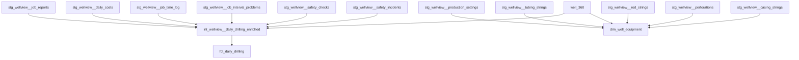

# Close WellView Daily Report and Casing Coverage Gaps

## Overview

Implement the next two mart-foundation priorities before Cortex semantic modeling:

1. Build a canonical daily-report-grain fact (`fct_daily_drilling`) to anchor operational metrics.
2. Extend `dim_well_equipment` with casing coverage so physical-well configuration is not tubing/rod/perf-only.

Then run a structured reassessment of entity-model completeness and semantic-model readiness.

## Locked Decisions

- `fct_daily_drilling` grain is fixed at one row per `stg_wellview__job_reports.report_id`.
- Child aggregate joins use deterministic precedence:
  - Cost and time joins by `job_report_id`.
  - NPT and safety joins by `(job_id, report_number)`.
  - Date fallback is allowed only when `report_number` is null, using `(job_id, event_date = report_date)`.
- Any date-fallback joins must be surfaced via explicit boolean flags in `fct_daily_drilling`.
- `fct_daily_drilling` is `table` materialized in this phase (no incremental logic).

## Research Context

Found brainstorm from **2026-02-14**: `docs/brainstorms/2026-02-14-wellview-intermediate-mart-modeling-brainstorm.md`.

### Internal Patterns to Follow

- `CLAUDE.md`: no `select *` in marts, explicit column contracts, scoped dbt validation, Snowflake-safe SQL.
- `docs/solutions/refactoring/drilling-mart-sprint-1-intermediate-patterns.md`: use intermediate when multi-source enrichment is complex; compute surrogate keys deterministically.
- `docs/solutions/refactoring/drilling-mart-sprint-2-fact-table-patterns.md`: add inferred-date flags, document expected nullable FKs, only use incremental when warranted.
- `docs/solutions/refactoring/wellview-eid-resolution-via-well-360.md`: resolve `eid` via `well_360.wellview_id` directly.

## Problem Statement

Current marts are strong but still missing key foundation pieces for clean semantic modeling:

- Daily report is defined as the Well Work heartbeat in `context/sources/wellview/entity_model.md`, but no canonical `fct_daily_drilling` exists.
- `dim_well_equipment` currently infers lift and summarizes tubing/rods/perforations/production settings, but omits casing signals.

Without these, semantic modeling will either duplicate logic or rely on mixed-grain joins.

## Scope

### In Scope

- New intermediate for daily-report enrichment.
- New daily-report fact at one row per `job_report_id`.
- Extend existing equipment dim with casing summary columns.
- Schema tests/docs updates.
- Post-implementation reassessment checklist and scorecard.

### Out of Scope

- `fct_drilling_performance` (stand/slide/rotate calc-table-dependent).
- `fct_well_configuration` historical effective-dated fact.
- Cortex semantic YAML implementation.

## Delivery Order

1. Build `int_wellview__daily_drilling_enriched` with deterministic child aggregations.
2. Build `fct_daily_drilling` plus docs/tests.
3. Extend `dim_well_equipment` with casing coverage plus docs/tests.
4. Run the reassessment gate and publish Go/No-Go.

## Architecture (ERD)

## Implementation Plan

### Phase 1: Canonical Daily Report Fact

#### Files

- `models/operations/intermediate/drilling/int_wellview__daily_drilling_enriched.sql` (new)
- `models/operations/marts/drilling/fct_daily_drilling.sql` (new)
- `models/operations/intermediate/drilling/schema.yml` (update)
- `models/operations/marts/drilling/schema.yml` (update)

#### Model Design

#### `models/operations/intermediate/drilling/int_wellview__daily_drilling_enriched.sql`

- Materialization: `ephemeral`
- Grain: one row per `report_id`
- Base: `stg_wellview__job_reports`
- Enrichments:
  - `daily_costs_agg` by `job_report_id`
  - `time_log_agg` by `job_report_id` (active rows only)
  - `npt_agg` by `(job_id, report_number)`
  - `safety_agg` by `(job_id, report_number)` across checks + incidents
  - `well_360` for `eid`
- Derived fields:
  - `daily_drilling_sk = generate_surrogate_key([report_id])`
  - `job_sk = generate_surrogate_key([job_id])`
  - `wellbore_sk = generate_surrogate_key([wellbore_id])` (nullable)
  - `source_synced_at = greatest(...)` from contributing sources
  - quality flags for inferred/missing child linkage, including date-fallback joins for NPT/safety

#### `models/operations/marts/drilling/fct_daily_drilling.sql`

- Materialization: `table`
- Recommended cluster: `['job_id', 'report_date']`
- Explicit final select only.
- Includes:
  - dimensional FKs: `job_sk`, `wellbore_sk`, `eid`
  - natural keys: `report_id`, `job_id`, `well_id`, `wellbore_id`
  - temporal: `report_date`, `report_number`, `days_from_spud`
  - drilling progress: depth start/end/progress, ROP, time totals
  - rolled-up measures: daily cost/time/NPT/safety counts and sums
  - audit: `source_synced_at`, `_loaded_at`

#### Tests

`models/operations/marts/drilling/schema.yml`:

- `fct_daily_drilling.daily_drilling_sk`: `unique`, `not_null`
- `fct_daily_drilling.report_id`: `unique`, `not_null`
- `fct_daily_drilling.job_sk`: `relationships` to `dim_job.job_sk` (warn)
- `fct_daily_drilling.wellbore_sk`: `relationships` to `dim_wellbore.wellbore_sk` (warn)
- `fct_daily_drilling.eid`: `relationships` to `well_360.eid` (warn)
- key measure sanity checks with `dbt_expectations` where useful (non-negative hours/cost)

### Phase 2: Add Casing Coverage to Equipment Dimension

#### Files

- `models/operations/marts/drilling/dim_well_equipment.sql` (update)
- `models/operations/marts/drilling/schema.yml` (update)

#### Model Changes

In `models/operations/marts/drilling/dim_well_equipment.sql`:

- Add `casing_actual` CTE from `stg_wellview__casing_strings` filtered to actual runs.
- Add `casing_summary` CTE grouped by `well_id` with:
  - `casing_string_count_actual`
  - `casing_strings_in_hole`
  - `latest_casing_run_date`
  - `latest_casing_pull_date`
  - `max_casing_set_depth_ft`
  - `max_casing_nominal_od_in`
  - `has_tapered_casing`
- Join `casing_summary` into `classified` and expose in `final`.
- Keep lift-type precedence unchanged:
  1. production method
  2. equipment inference
  3. setting objective

#### Tests

`models/operations/marts/drilling/schema.yml` additions:

- Document all new casing columns.
- Add at least one non-null warning check where appropriate (`casing_string_count_actual` defaults to 0).
- Preserve existing `well_equipment_sk`/`well_id` uniqueness and `eid` relationship tests.

## SpecFlow Gap Analysis (Applied to This Plan)

### Flow Overview

1. Analyst asks daily operations question by date/job/well.
2. Semantic layer hits `fct_daily_drilling` for daily grain metrics.
3. Analyst asks equipment configuration question.
4. Semantic layer hits `dim_well_equipment` for lift + casing context.

### Critical Gaps Addressed

- Missing canonical daily grain causing mixed-grain metric logic.
- Missing casing in equipment dim causing incomplete physical configuration context.

### Remaining Ambiguities to Resolve During Implementation

1. Null handling for `wellbore_id` in report rows with no linked wellbore.
2. Whether any child aggregates should exclude inactive/soft-deleted rows beyond staging defaults.

## Validation Plan

### Build/Parse

- `dbt parse`
- `dbt build --select int_wellview__daily_drilling_enriched fct_daily_drilling dim_well_equipment`
- `dbt show --select fct_daily_drilling --limit 20`
- `dbt show --select dim_well_equipment --limit 20`

### SQL Validation Queries (Snowflake)

- row-grain check: one row per `report_id` in `fct_daily_drilling`
- orphan checks: `job_sk`, `wellbore_sk`, `eid`
- measure spot checks against existing facts for sample wells and date ranges:
  - cost totals vs `fct_daily_drilling_cost`
  - time totals vs `fct_drilling_time`
  - NPT totals vs `fct_npt_events`
- fallback join observability checks:
  - percent of records where NPT joined via date fallback
  - percent of records where safety joined via date fallback
  - sampled rows confirming fallback behavior is expected

### Quality Gates

- SQLFluff clean for touched SQL.
- YAML lint clean for touched schema files.
- No regressions in existing drilling marts selected tests.

## Risks and Mitigations

- Risk: double counting from joining unaggregated child tables.
  - Mitigation: aggregate each child source in isolated CTEs before joins.
- Risk: mismatched NPT/safety to report grain.
  - Mitigation: deterministic join keys + explicit inferred flags.
- Risk: casing source sparsity on some wells.
  - Mitigation: default numeric outputs to 0 and keep timestamps nullable.

## Reassessment Gate (After Phases 1 and 2)

Create a short checkpoint note in:

- `docs/solutions/refactoring/2026-02-16-wellview-mart-foundation-reassessment.md` (new)

Required sections:

1. **Entity model completeness scorecard**
   - Physical Well
   - Well Work
   - Cross-domain prerequisites
2. **Semantic readiness scorecard**
   - stable grain
   - conformed keys
   - additive measure definitions
   - expected null FK documentation
   - dimensional filter coverage
3. **Go/No-Go decision** for starting/repairing Cortex semantic YAMLs.

## Execution Checklist

- [ ] Create `models/operations/intermediate/drilling/int_wellview__daily_drilling_enriched.sql`.
- [ ] Create `models/operations/marts/drilling/fct_daily_drilling.sql`.
- [ ] Update `models/operations/intermediate/drilling/schema.yml`.
- [ ] Update `models/operations/marts/drilling/schema.yml` for `fct_daily_drilling`.
- [ ] Update `models/operations/marts/drilling/dim_well_equipment.sql` with casing summary CTEs and final columns.
- [ ] Update `models/operations/marts/drilling/schema.yml` for new casing fields.
- [ ] Run parse/build/show validations listed in this document.
- [ ] Write reassessment note with explicit Go/No-Go conclusion.

## Acceptance Criteria

- [ ] `fct_daily_drilling` exists at one row per `report_id` with explicit column contract.
- [ ] `dim_well_equipment` includes casing summary fields with documented semantics.
- [ ] New/updated marts have schema docs and tests aligned to existing drilling mart standards.
- [ ] Validation confirms no material mismatch against existing cost/time/NPT facts for sampled wells.
- [ ] Reassessment document is produced with explicit Go/No-Go for semantic modeling.

## References

- `CLAUDE.md`
- `context/sources/wellview/entity_model.md`
- `docs/brainstorms/2026-02-14-wellview-intermediate-mart-modeling-brainstorm.md`
- `docs/solutions/refactoring/drilling-mart-sprint-1-intermediate-patterns.md`
- `docs/solutions/refactoring/drilling-mart-sprint-2-fact-table-patterns.md`
- `docs/solutions/refactoring/wellview-eid-resolution-via-well-360.md`
