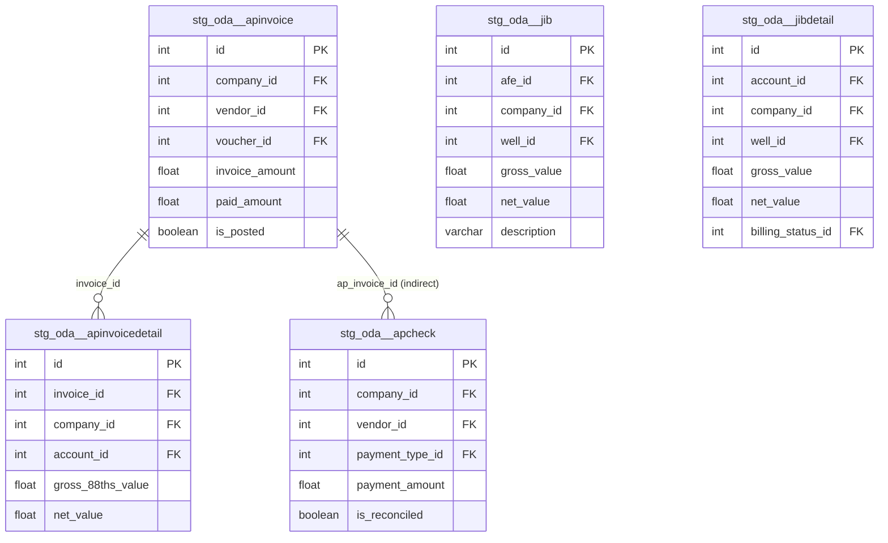

# ODA Staging Refactor Sprint 1: Accounts Payable + Supporting CDC (5 Models)

## Enhancement Summary

**Deepened on:** 2026-02-17
**Research agents used:** learnings-researcher (6 files), best-practices-researcher (dbt/Estuary/Snowflake), explore (FK verification)

### Key Improvements from Research
1. **JIBDetail has NO direct FK to JIB** — parallel denormalized views, not parent-child. ERD and relationship tests corrected.
2. **Estuary CDC `!= 'd'` confirmed sufficient** — merge strategy guarantees one row per PK. No special `'u'` handling needed. No dedup in source CTE needed (unlike Fivetran).
3. **CI `--defer` transient failure risk** — column renames can cause `invalid identifier` in CI on unmodified downstream models. Self-resolves on next prod run.
4. **Boolean conversion placement** — raw integer values in `renamed` CTE, boolean flags computed in `enhanced` CTE (per WellView Sprint 3 learnings).
5. **YAML test syntax confirmed** — `arguments:` wrapper required for `relationships`/`accepted_values`; `config:` wrapper required for `severity`. Always verify with `dbt parse --warn-error --no-partial-parse`.

### Institutional Learnings Applied
- `docs/solutions/refactoring/oda-context-documentation-sprint-0.md` — CDC classification rules, stale table detection
- `docs/solutions/refactoring/prodview-staging-5-cte-pattern.md` — CTE responsibility boundaries
- `docs/solutions/refactoring/wellview-staging-5cte-refactor-sprint-3.md` — Swarm execution: sequential writes only
- `docs/solutions/build-errors/ci-dbt-parse-missing-arguments-deprecation.md` — YAML test syntax
- `docs/solutions/build-errors/ci-defer-stale-column-names.md` — Transient CI failures after renames
- `docs/solutions/refactoring/mart-quoted-alias-restoration-after-snake-case-refactor.md` — Downstream cascade checks

---

## Overview

Refactor 5 ODA staging models from the current 2-CTE pattern to the standard 5-CTE pattern. These are the highest-priority models because 4 of them are CDC tables currently **leaking soft-deleted records** (no `_operation_type != 'd'` filter). Organize into domain subdirectories, add YAML column documentation + tests, and update the single downstream consumer.

**Critical data quality fix**: 4 of 5 models are CDC tables with 6.8M–63M rows that include deleted records in downstream queries today. Adding `_operation_type != 'd'` filtering is the primary driver.

## Models in Scope

| # | Model | Source Table | Connector | Rows | Key Fix |
|---|-------|-------------|-----------|------|---------|
| 1 | `stg_oda__apinvoice` | ODA_APINVOICE | CDC | 334K | Add soft-delete filter |
| 2 | `stg_oda__apinvoicedetail` | ODA_APINVOICEDETAIL | CDC | 6.8M | Add soft-delete filter |
| 3 | `stg_oda__apcheck` | ODA_APCHECK | Old connector (batch-like) | 49.5K | Keep as-is (no CDC) |
| 4 | `stg_oda__jib` | ODA_JIB | CDC | 63M | Add soft-delete filter |
| 5 | `stg_oda__jibdetail` | ODA_JIBDETAIL | CDC | 63M | Add soft-delete filter |

## Current State Analysis

All 5 models currently use a **2-CTE pattern** (source → renamed → `select *`):
- **No config block** — missing `materialized='view'` and tags
- **No soft-delete filtering** — CDC models include `_operation_type = 'd'` records
- **No type casting** — raw source types passed through
- **No surrogate keys** — missing `generate_surrogate_key()`
- **No `_loaded_at`** — missing dbt metadata timestamp
- **`flow_document` included** — large JSON column not needed downstream
- **Boolean columns as integers** — `reconciled`, `system_generated`, `voided`, `posted` stored as 0/1

### Downstream Consumer Analysis

Only **1 downstream model** directly references Sprint 1 models:

**`dim_ap_check_register.sql`** references `stg_oda__apcheck` and uses these columns:
- `transaction_number`, `company_id`, `issued_date`, `payment_type_code`
- `system_generated` (compared as `= 0` integer on line 98)
- `payment_amount`, `reconciled` (compared as `= '1'` string on line 103)
- `voided_date`, `payment_type_id`, `vendor_id`, `voucher_id`

**Breaking change risk**: Converting `system_generated` to `is_system_generated` (boolean) breaks line 98's `= 0` comparison. Converting `reconciled` to `is_reconciled` (boolean) breaks line 103's `= '1'` comparison. **Both downstream references must be updated in the same PR.**

The other 4 models (apinvoice, apinvoicedetail, jib, jibdetail) have **no direct downstream consumers** currently.

## Technical Approach

### 5-CTE Pattern (from `docs/conventions/staging.md`)

Every model follows this structure:

```sql
{{
    config(
        materialized='view',
        tags=['oda', 'staging', 'formentera']
    )
}}

with source as (
    select * from {{ source('oda', 'TABLE_NAME') }}
),

renamed as (
    select
        -- identifiers
        ID::int as id,
        ...
        -- CDC metadata
        "_meta/op"::varchar as _operation_type,
        flow_published_at::timestamp_tz as _flow_published_at
    from source
),

filtered as (
    select * from renamed
    where _operation_type != 'd'  -- CDC only
      and id is not null
),

enhanced as (
    select
        {{ dbt_utils.generate_surrogate_key(['id']) }} as {model}_sk,
        *,
        current_timestamp() as _loaded_at
    from filtered
),

final as (
    select
        -- surrogate key
        {model}_sk,
        -- identifiers
        id,
        ...
        -- dbt metadata
        _loaded_at,
        -- ingestion metadata
        _operation_type,
        _flow_published_at
    from enhanced
)

select * from final
```

### CDC vs Non-CDC Differences

| Aspect | CDC Models (1,2,4,5) | Non-CDC Model (3 - apcheck) |
|--------|---------------------|----------------------------|
| `"_meta/op"` column | Include as `_operation_type` | Exclude (not available) |
| Filtered CTE | `_operation_type != 'd' and id is not null` | `id is not null` only |
| `flow_published_at` | Include as `_flow_published_at` | Include as `_flow_published_at` |
| `flow_document` | Exclude | Exclude |

### Type Casting Conventions

| Type | Pattern | Example |
|------|---------|---------|
| String IDs/codes | `trim(COL)::varchar` | `trim(CODE)::varchar as code` |
| Integer IDs | `COL::int` | `ID::int as id` |
| Financial amounts | `COL::float` | `PAYMENTAMOUNT::float as payment_amount` |
| Dates | `COL::date` | `ISSUEDDATE::date as issued_date` |
| Timestamps | `COL::timestamp_ntz` | `CREATEDATE::timestamp_ntz as created_at` |
| Booleans (0/1) | `coalesce(COL = 1, false)` | `coalesce(POSTED = 1, false) as is_posted` |

### Audit Column Naming Convention

Following the GL model pattern (not the WellView `_utc` suffix pattern):

| Source Column | Staging Column |
|--------------|---------------|
| `CREATEDATE` | `created_at` |
| `UPDATEDATE` | `updated_at` |
| `RECORDINSERTDATE` | `record_inserted_at` |
| `RECORDUPDATEDATE` | `record_updated_at` |

### Boolean Conversion Pattern

ODA uses integer booleans (1/0). Convert using the GL model's `coalesce(COL = 1, false)` pattern.

> **Research insight**: WellView Sprint 3 found that boolean flags should be computed in the `enhanced` CTE, not `renamed`. However, the GL model (our ODA reference) computes them inline in `renamed` using `coalesce(COL = 1, false)`. For consistency within the ODA source, **follow the GL pattern** and compute booleans in `renamed`. This is a pragmatic deviation — the convention docs don't mandate which CTE for boolean conversion, and keeping all ODA models consistent with GL is more important than strict CTE purity.

| Source Column | Staging Column |
|--------------|---------------|
| `APPROVEDFORPOSTING` | `is_approved_for_posting` |
| `POSTED` | `is_posted` |
| `READYTOPAY` | `is_ready_to_pay` |
| `RECONCILED` | `is_reconciled` |
| `SYSTEMGENERATED` | `is_system_generated` |
| `VOIDED` | `is_voided` |
| `ISFROMAPHISTORYIMPORT` | `is_from_ap_history_import` |
| `PAYMENTDETAILINCOMPLETE` | `is_payment_detail_incomplete` |
| `ISALLOCATIONGENERATED` | `is_allocation_generated` |
| `ISALLOCATIONPARENT` | `is_allocation_parent` |
| `INCLUDEINACCRUALREPORT` | `is_include_in_accrual_report` |
| `CURRENCYFLUCTUATIONPASSTHROUGH` | `is_currency_fluctuation_passthrough` |

### Estuary CDC Semantics (Research-Confirmed)

Estuary's merge strategy guarantees **one row per primary key** in Snowflake. Operation types:

| `_meta/op` Value | Meaning | dbt Action |
|-----------------|---------|-----------|
| `'c'` | Create/insert | Include |
| `'u'` | Update (latest state) | Include |
| `'d'` | Delete (soft-delete marker) | **Exclude** |

**`_operation_type != 'd'` is sufficient** — no special handling for `'u'` needed. No dedup in source CTE needed (unlike Fivetran where `qualify row_number()` is required). Estuary CDC tables are already deduplicated by the connector's merge strategy.

## Directory Reorganization

### Target Structure

```
models/operations/staging/oda/
├── accounts_payable/
│   ├── stg_oda__apinvoice.sql
│   ├── stg_oda__apinvoicedetail.sql
│   ├── stg_oda__apcheck.sql
│   ├── _src_oda__accounts_payable.yml
│   └── _stg_oda__accounts_payable.yml
├── supporting/
│   ├── stg_oda__jib.sql
│   ├── stg_oda__jibdetail.sql
│   ├── _src_oda__supporting.yml
│   └── _stg_oda__supporting.yml
├── (remaining models stay in oda/ root until their sprint)
├── src_oda.yml              ← Remove 5 moved table entries
└── schema.yml               ← No Sprint 1 model entries to remove
```

### Source YAML Pattern (Split-Source)

Each domain gets its own `_src_oda__*.yml` using the **same source name** (`oda`). dbt merges table definitions from files sharing the same source name.

```yaml
# accounts_payable/_src_oda__accounts_payable.yml
version: 2

sources:
  - name: oda
    database: ESTUARY_DB
    schema: ESTUARY_SCHEMA
    tables:
      - name: ODA_APINVOICE
        description: "AP invoices — vendor invoices with payment status, amounts, discount terms (CDC)"
      - name: ODA_APINVOICEDETAIL
        description: "AP invoice line items — cost allocations with well/AFE assignment (CDC)"
      - name: ODA_APCHECK
        description: "AP checks — payments issued against invoices (old connector, batch-like)"
```

### Source Entry Removal from `src_oda.yml`

Remove these 5 table entries from `src_oda.yml` (lines 10-11, 49-50, 107-108):
- `ODA_APINVOICE` (line 10)
- `ODA_APINVOICEDETAIL` (line 11)
- `ODA_JIB` (line 49)
- `ODA_JIBDETAIL` (line 50)
- `ODA_APCHECK` (line 107)

**Do NOT remove GL** — it stays in the root until the General Ledger domain sprint.

## Implementation Phases

### Phase 1: Setup + Directory Structure

**Tasks:**
1. Create feature branch `feature/oda-staging-refactor-sprint-1`
2. Create directories: `accounts_payable/`, `supporting/`
3. Move existing SQL files to new directories (git mv for history)
4. Create source YAML files (`_src_oda__accounts_payable.yml`, `_src_oda__supporting.yml`)
5. Remove 5 table entries from root `src_oda.yml`
6. Validate `dbt parse` passes (source references resolve correctly)

**Files created/modified:**
- `models/operations/staging/oda/accounts_payable/` (new directory)
- `models/operations/staging/oda/supporting/` (new directory)
- `models/operations/staging/oda/accounts_payable/_src_oda__accounts_payable.yml` (new)
- `models/operations/staging/oda/supporting/_src_oda__supporting.yml` (new)
- `models/operations/staging/oda/src_oda.yml` (modified — remove 5 entries)

### Phase 2: Refactor AP Models (3 models)

**Task 2a: `stg_oda__apinvoice.sql`** (CDC, 334K rows, ~70 columns)
- Convert to 5-CTE pattern
- Add CDC metadata: `"_meta/op"::varchar as _operation_type`, `flow_published_at::timestamp_tz as _flow_published_at`
- Add soft-delete filter: `_operation_type != 'd'`
- Type cast all columns (IDs→int, amounts→float, dates→date/timestamp_ntz, booleans→coalesce pattern)
- Exclude `flow_document`
- Add surrogate key: `apinvoice_sk`
- Add `_loaded_at`
- Explicit column list in final CTE grouped by category

**Task 2b: `stg_oda__apinvoicedetail.sql`** (CDC, 6.8M rows, ~35 columns)
- Same as 2a pattern
- Key FK: `invoice_id` → references apinvoice
- Add surrogate key: `apinvoicedetail_sk`

**Task 2c: `stg_oda__apcheck.sql`** (Non-CDC, 49.5K rows, ~27 columns)
- Convert to 5-CTE pattern **without CDC filtering**
- No `_operation_type` column (not available on old connector)
- Include `flow_published_at::timestamp_tz as _flow_published_at`
- Convert booleans: `reconciled` → `is_reconciled`, `system_generated` → `is_system_generated`, `voided` → `is_voided`
- Rename audit columns: `create_date` → `created_at`, `update_date` → `updated_at`, `record_insert_date` → `record_inserted_at`, `record_update_date` → `record_updated_at`
- Add surrogate key: `apcheck_sk`

**Files modified:**
- `models/operations/staging/oda/accounts_payable/stg_oda__apinvoice.sql`
- `models/operations/staging/oda/accounts_payable/stg_oda__apinvoicedetail.sql`
- `models/operations/staging/oda/accounts_payable/stg_oda__apcheck.sql`

### Phase 3: Refactor Supporting Models (2 models)

**Task 3a: `stg_oda__jib.sql`** (CDC, 63M rows, ~60 columns)
- Convert to 5-CTE pattern with CDC filtering
- Heavily denormalized: 22 code/name columns — keep them (downstream uses them for reporting)
- Add surrogate key: `jib_sk`
- Type cast: codes→`trim()::varchar`, IDs→`::int`, amounts→`::float`, dates→`::date`

**Task 3b: `stg_oda__jibdetail.sql`** (CDC, 63M rows, ~62 columns)
- Convert to 5-CTE pattern with CDC filtering
- Normalized with full FK references: 9 entity variants, 8 relationship IDs
- Add surrogate key: `jibdetail_sk`
- Convert booleans: `is_allocation_generated`, `is_allocation_parent`, `is_include_in_accrual_report`, etc.

**Files modified:**
- `models/operations/staging/oda/supporting/stg_oda__jib.sql`
- `models/operations/staging/oda/supporting/stg_oda__jibdetail.sql`

### Phase 4: YAML Documentation + Tests

**Task 4a: `_stg_oda__accounts_payable.yml`** (new)
- Model descriptions for all 3 AP models (source, grain, CDC/batch, row count)
- Column descriptions for every column in each model's final CTE
- Tests:
  - `unique` + `not_null` on `id` (all 3 models)
  - `not_null` on critical FKs: `company_id`, `vendor_id`, `account_id`
  - `relationships`: `apinvoicedetail.invoice_id` → `apinvoice.id`
  - `accepted_values` on boolean columns (with `arguments:` wrapper)

**Task 4b: `_stg_oda__supporting.yml`** (new)
- Model descriptions for JIB + JIBDetail
- Column descriptions for all columns
- Tests:
  - `unique` + `not_null` on `id`
  - `not_null` on critical FKs: `company_id`, `account_id`, `well_id`
  - **No JIBDetail→JIB relationship test** — ODA_JIBDETAIL has NO direct FK to ODA_JIB (see Research Insight below)

> **Research insight (CRITICAL)**: ODA_JIBDETAIL does **not** have a `JIBID` column. JIB and JIBDetail are **parallel denormalized views** of the same underlying JIB transactions — JIB has summary-level codes/names, JIBDetail has normalized FK references. They relate via shared business keys (account_id, well_id, company_id, voucher_id) not via a direct parent-child FK. Do NOT add a `relationships` test between them.

**Test syntax rules (dbt 1.11+):**
```yaml
# Correct — always use arguments: wrapper
- relationships:
    arguments:
      to: ref("stg_oda__apinvoice")
      field: id

# Correct — always use config: wrapper for severity
- not_null:
    config:
      severity: warn

# Correct — accepted_values needs arguments: wrapper
- accepted_values:
    arguments:
      values: [true, false]
```

**Files created:**
- `models/operations/staging/oda/accounts_payable/_stg_oda__accounts_payable.yml`
- `models/operations/staging/oda/supporting/_stg_oda__supporting.yml`

### Phase 5: Downstream Consumer Update

**Task 5: Update `dim_ap_check_register.sql`**

Update column references to match new apcheck column names:

| Old Reference | New Reference | Line |
|--------------|--------------|------|
| `ac.system_generated = 0` | `ac.is_system_generated = false` | 98 |
| `ac.reconciled = '1'` | `ac.is_reconciled = true` | 103 |

No other column renames affect this downstream model — `transaction_number`, `company_id`, `issued_date`, `payment_type_code`, `payment_amount`, `voided_date`, `payment_type_id`, `vendor_id`, `voucher_id` all keep the same names.

**Files modified:**
- `models/operations/marts/finance/dim_ap_check_register.sql`

### Phase 6: Validation + PR

**Task 6a: Structural validation**
```bash
python scripts/validate_staging.py \
  models/operations/staging/oda/accounts_payable/stg_oda__apinvoice.sql \
  models/operations/staging/oda/accounts_payable/stg_oda__apinvoicedetail.sql \
  models/operations/staging/oda/accounts_payable/stg_oda__apcheck.sql \
  models/operations/staging/oda/supporting/stg_oda__jib.sql \
  models/operations/staging/oda/supporting/stg_oda__jibdetail.sql
```

**Task 6b: dbt parse**
```bash
dbt parse --warn-error --no-partial-parse
```

**Task 6c: dbt build**
```bash
dbt build --select stg_oda__apinvoice stg_oda__apinvoicedetail stg_oda__apcheck stg_oda__jib stg_oda__jibdetail
```

**Task 6d: Downstream build**
```bash
dbt build --select dim_ap_check_register
```

**Task 6e: Data preview**
```bash
dbt show --select stg_oda__apinvoice --limit 10
dbt show --select stg_oda__apcheck --limit 10
```

**Task 6f: Create PR**
- Branch: `feature/oda-staging-refactor-sprint-1`
- Title: "refactor(oda): Sprint 1 — AP + Supporting CDC staging models (5-CTE pattern)"

## Acceptance Criteria

- [x] All 5 models follow 5-CTE pattern with correct CTE names (source, renamed, filtered, enhanced, final)
- [x] All 4 CDC models have `_operation_type != 'd'` in filtered CTE
- [x] All models have `materialized='view'` and `tags=['oda', 'staging', 'formentera']`
- [x] All models have surrogate key + `_loaded_at` in enhanced CTE
- [x] All models have explicit column list in final CTE (no `SELECT *`)
- [x] Models organized into `accounts_payable/` and `supporting/` subdirectories
- [x] Source entries moved from `src_oda.yml` to domain-specific `_src_oda__*.yml` files
- [x] YAML documentation with tests for all 5 models
- [x] `dim_ap_check_register` updated to match boolean column renames
- [x] `python scripts/validate_staging.py` passes on all 5 models
- [x] `dbt build --select stg_oda__apinvoice stg_oda__apinvoicedetail stg_oda__apcheck stg_oda__jib stg_oda__jibdetail` passes with 0 errors (30 PASS, 1 WARN)
- [x] `dbt build --select dim_ap_check_register` passes with 0 errors (48,436 rows)
- [ ] PR created on branch `feature/oda-staging-refactor-sprint-1`

## Known Gotchas

1. **`_meta/op` quoting**: Must be quoted as `"_meta/op"` in SQL (slash in column name). Alias to `_operation_type`.
2. **apcheck is NOT CDC**: Old Estuary connector. Do NOT add `_operation_type` filtering. It has `flow_published_at` but no `"_meta/op"` column.
3. **Tag order**: Must be `['oda', 'staging', 'formentera']` — source first, then layer, then org.
4. **`flow_document` exclusion**: Exclude from all models — large JSON blob.
5. **Boolean downstream cascade**: `dim_ap_check_register` compares `system_generated = 0` and `reconciled = '1'` — must update to boolean comparisons.
6. **GL tag discrepancy**: Current GL model uses `tags=['staging', 'oda', 'gl']` (wrong order + extra tag). Sprint 1 models should use correct order `['oda', 'staging', 'formentera']`. GL tag fix is out of scope.
7. **GL pattern is simplified**: GL uses 2 CTEs (source → renamed → WHERE filter) without explicit enhanced/final CTEs. Sprint 1 models should follow the **full 5-CTE** convention, not GL's simplified variant.
8. **JIBDetail has NO FK to JIB** (RESOLVED): Research confirmed ODA_JIBDETAIL does not have a `JIBID` column. JIB and JIBDetail are parallel denormalized views of the same transactions — no parent-child relationship test needed.
9. **CI `--defer` transient failures** (from learnings): After column renames in staging, CI may fail on downstream models not in this PR with `invalid identifier` errors. This self-resolves when production runs rebuild the staging views. If needed, touch the staging model to force CI to build it fresh.
10. **YAML test syntax** (from learnings): Always use `arguments:` wrapper for `relationships`/`accepted_values` and `config:` wrapper for `severity`. Bare syntax passes local partial parse but fails `dbt parse --warn-error --no-partial-parse` in CI.
11. **No dedup needed for Estuary CDC**: Unlike Fivetran, Estuary CDC uses a merge strategy that guarantees one row per PK. Do NOT add `qualify row_number()` in the source CTE — it's unnecessary and would add overhead on 63M+ row tables.
12. **Swarm execution: sequential writes only** (from WellView Sprint 3): If using parallel agents, each agent must write files sequentially. Parallel `Write` calls cause cascading failures.

## ERD: Sprint 1 Model Relationships



> **Note**: JIB and JIBDetail are **parallel denormalized views** of the same JIB transactions — NOT parent-child. JIB has summary codes/names; JIBDetail has normalized FK references. They share business keys (account_id, well_id, company_id) but have no direct FK relationship.

## Performance Considerations (Research-Informed)

### View Materialization for Large CDC Tables

All 5 models remain as `view` materialization. Research confirms this is correct for Sprint 1:

| Model | Rows | Materialization | Rationale |
|-------|------|----------------|-----------|
| `stg_oda__jib` | 63M | `view` | Keep as view; monitor downstream query times |
| `stg_oda__jibdetail` | 63M | `view` | Keep as view; monitor downstream query times |
| `stg_oda__apinvoicedetail` | 6.8M | `view` | Fine as view |
| `stg_oda__apinvoice` | 334K | `view` | Fine as view |
| `stg_oda__apcheck` | 49.5K | `view` | Trivial |

**Switch to `table` only if** downstream queries consistently exceed 30-60 seconds. Snowflake cannot prune micro-partitions effectively for `WHERE _operation_type != 'd'` because deleted rows are scattered across all partitions (CDC arrival order, not clustered by operation type). If materialization change needed later:

```sql
config(
    materialized='table',
    cluster_by=['company_id'],
    tags=['oda', 'staging', 'formentera'],
    snowflake_warehouse=set_warehouse_size('M')
)
```

### Explicit Column Lists in Final CTE

The `final` CTE's explicit column list enables Snowflake's columnar pruning — downstream queries only scan columns they reference, even though the view definition includes all columns. This is already enforced by the 5-CTE convention.

## Context Files Reference

| File | Purpose |
|------|---------|
| `context/sources/oda/oda.md` | System overview, Estuary architecture, CDC vs batch |
| `context/sources/oda/domains/accounts_payable.yaml` | AP domain relationships, tables |
| `context/sources/oda/domains/supporting.yaml` | Supporting domain relationships |
| `context/sources/oda/tables/ODA_APINVOICE.yaml` | Column definitions (58 columns) |
| `context/sources/oda/tables/ODA_APINVOICEDETAIL.yaml` | Column definitions (33 columns) |
| `context/sources/oda/tables/ODA_APCHECK.yaml` | Column definitions (25 columns) |
| `context/sources/oda/tables/ODA_JIB.yaml` | Column definitions (52 columns) |
| `context/sources/oda/tables/ODA_JIBDETAIL.yaml` | Column definitions (53 columns) |
| `docs/conventions/staging.md` | 5-CTE pattern spec, type casting, tag schema |

## References

- Brainstorm: `docs/brainstorms/2026-02-17-oda-staging-refactor-brainstorm.md`
- Sprint 0 learnings: `docs/solutions/refactoring/oda-context-documentation-sprint-0.md`
- GL reference model: `models/operations/staging/oda/stg_oda__gl.sql`
- WellView split-source pattern: `models/operations/staging/wellview/general/_src_wellview.yml`
- Staging conventions: `docs/conventions/staging.md`
