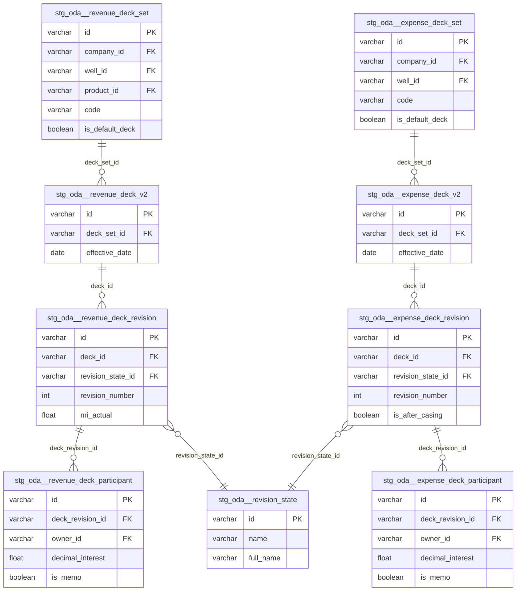

# ODA Staging Refactor Sprint 2: Remaining Supporting + Revenue & Expense Decks (13 Models)

## Overview

Refactor 13 ODA staging models from the current 2-CTE pattern to the standard 5-CTE pattern. All 13 are **batch tables** — no CDC filtering needed. Complete the `supporting/` directory (5 new models) and create the new `decks/` directory (8 models). Add YAML column documentation + tests, and update 8 downstream consumers.

**Significantly higher downstream impact than Sprint 1** — 8 distinct intermediate/mart consumers reference these models, including the heavily-used `int_general_ledger_enhanced` (8 Sprint 2 model references) and the production interest models (`int_oda_latest_company_WI`, `int_oda_latest_company_NRI`).

## Models in Scope

### Supporting (5 batch models → extend `supporting/` directory)

| # | Model | Source Table | Rows | Notes |
|---|-------|-------------|------|-------|
| 1 | `stg_oda__checkrevenue` | ODA_CHECKREVENUE | 659K | Old connector — stale since Jan 11. Document risk in header. |
| 2 | `stg_oda__calendar` | MDM_CALENDAR | 37K | Shared MDM table, not ODA-specific. PK is `date_key` not `id`. |
| 3 | `stg_oda__userfield` | ODA_USERFIELD | 4.8M | EAV key-value table. Currently exposes quoted camelCase — 4 consumers use quoted names. |
| 4 | `stg_oda__revision_state` | ODA_REVISIONSTATE | 3 | Tiny lookup (draft, approved, superseded). PK is integer `id`. |
| 5 | `stg_oda__source_module` | ODA_BATCH_ODA_SOURCEMODULE | 26 | Tiny lookup for ODA module identifiers (GL, AP, AR, JIB). |

### Revenue & Expense Decks (8 batch models → new `decks/` directory)

| # | Model | Source Table | Rows | Notes |
|---|-------|-------------|------|-------|
| 6 | `stg_oda__revenue_deck_v2` | ODA_BATCH_ODA_REVENUEDECK_V2 | 20K | Deck headers linking sets to effective dates. |
| 7 | `stg_oda__revenue_deck_set` | ODA_REVENUEDECKSET | 19K | Groups revisions by product/interest type per well/company. |
| 8 | `stg_oda__revenue_deck_revision` | ODA_REVENUEDECKREVISION | 346K | Point-in-time snapshots of revenue interest allocations. |
| 9 | `stg_oda__revenue_deck_participant` | ODA_REVENUEDECKPARTICIPANT | **196M** | **KEEP AS VIEW.** 2nd largest ODA table. |
| 10 | `stg_oda__expense_deck_v2` | ODA_BATCH_ODA_EXPENSEDECK_V2 | 9.7K | Expense deck headers. |
| 11 | `stg_oda__expense_deck_set` | ODA_EXPENSEDECKSET | 7.6K | Groups revisions by cost type per well/company. |
| 12 | `stg_oda__expense_deck_revision` | ODA_BATCH_ODA_EXPENSEDECKREVISIONVIEW | 22K | **Evaluate VIEW vs non-VIEW** (Sprint 0 flagged). |
| 13 | `stg_oda__expense_deck_participant` | ODA_BATCH_ODA_EXPENSEDECKPARTICIPANT | 877K | Owner-level expense interest allocations. |

## Downstream Consumer Analysis

### Critical Consumer: `int_general_ledger_enhanced` (8 Sprint 2 refs)

**File:** `models/operations/intermediate/finance/int_general_ledger_enhanced.sql`

| Sprint 2 Model | Columns Used | Join Pattern |
|----------------|-------------|--------------|
| `stg_oda__userfield` | `"Id"`, `"UserFieldName"`, `"UserFieldValueString"` (QUOTED camelCase!) | `WHERE "UserFieldName" = 'UF-SEARCH KEY'`, joined on `location_well_id = "Id"` |
| `stg_oda__source_module` | `code`, `name` | Joined on `source_module_code = code` |
| `stg_oda__revenue_deck_revision` | `id`, `deck_id`, `revision_number`, `nri_actual`, `total_interest_expected` | Joined on `source_revenue_deck_revision_id = id` |
| `stg_oda__revenue_deck_v2` | `id`, `deck_set_id`, `effective_date` | Chained: `rev_deck_revisions.deck_id = rev_decks.id` |
| `stg_oda__revenue_deck_set` | `id` | Chained: `rev_decks.deck_set_id = rev_deck_sets.id` |
| `stg_oda__expense_deck_revision` | `id`, `deck_id`, `revision_number`, `total_interest_actual` | Joined on `source_expense_deck_revision_id = id` |
| `stg_oda__expense_deck_v2` | `id`, `deck_set_id`, `effective_date` | Chained: `exp_deck_revisions.deck_id = exp_decks.id` |
| `stg_oda__expense_deck_set` | `id`, `code` | Chained: `exp_decks.deck_set_id = exp_deck_sets.id` |

**Impact**: Most deck columns are already snake_case (no rename needed for business columns). Main renames: `create_date` → `created_at`, `update_date` → `updated_at`, `record_insert_date` → `record_inserted_at`, `record_update_date` → `record_updated_at`. These audit columns are NOT referenced by int_general_ledger_enhanced — **no changes needed** to this consumer for deck models.

**CRITICAL**: Userfield rename from quoted camelCase to snake_case WILL break this consumer. Must update lines 57-65.

### Critical Consumer: `int_gl_enhanced` (7 Sprint 2 refs)

**File:** `models/operations/intermediate/finance/int_gl_enhanced.sql`

Same pattern as int_general_ledger_enhanced but with cleaner CTE structure. Uses:
- `stg_oda__userfield`: `"Id"`, `"UserFieldName"`, `"UserFieldValueString"`, `"EntityTypeId"`, `"UserFieldIdentity"` (QUOTED camelCase)
- `stg_oda__source_module`: `code`, `name`
- Revenue deck chain: same joins as above
- Expense deck chain: same joins as above

**Impact**: Userfield rename breaks this consumer. Must update lines 123-131.

### Critical Consumer: `int_oda_latest_company_NRI` (5 Sprint 2 refs)

**File:** `models/operations/intermediate/production/int_oda_latest_company_NRI.sql`

| Sprint 2 Model | Columns Used | Breaking Renames |
|----------------|-------------|-----------------|
| `stg_oda__revenue_deck_participant` | `id`, `deck_revision_id`, `decimal_interest`, `company_id`, `interest_type_id`, `is_memo` | None — already snake_case |
| `stg_oda__revenue_deck_revision` | `id`, `deck_id`, `name`, `revision_number`, `revision_state_id`, `import_data_id`, `close_date`, **`create_date`**, **`update_date`** | `create_date` → `created_at`, `update_date` → `updated_at` |
| `stg_oda__revenue_deck_v2` | `id`, `deck_set_id`, `effective_date` | None |
| `stg_oda__revenue_deck_set` | `id`, `company_id`, `well_id`, `product_id`, `code` | None |
| `stg_oda__revision_state` | `id` | None |

**Impact**: Lines 69-70 use `rdr.create_date` and `rdr.update_date` directly. Must update to `created_at` / `updated_at`.

### Critical Consumer: `int_oda_latest_company_WI` (5 Sprint 2 refs)

**File:** `models/operations/intermediate/production/int_oda_latest_company_WI.sql`

Mirror of NRI but for expense decks. Lines 65-66 use `edr.create_date` and `edr.update_date`.

**Impact**: `create_date` → `created_at`, `update_date` → `updated_at`.

### Consumer: `int_oda_calendar`

**File:** `models/operations/intermediate/finance/int_oda_calendar.sql`

Maps every calendar column by name: `DATE_KEY AS "DateKey"`, `DATE AS "Date"`, etc. Exact column name match required.

**Impact**: Current model already uses snake_case output (`date_key`, `date`, `day`, etc.). The downstream `int_oda_calendar` references these exact names. Must preserve all column names exactly.

### Consumer: `dim_revenue_check_register`

**File:** `models/operations/marts/finance/dim_revenue_check_register.sql`

Uses from `stg_oda__checkrevenue`:
- `transaction_number`, `company_id`, `issued_date`, `payment_type_code`, `check_amount`, `voided_date`, `payment_type_id`, `owner_id`, `voucher_id` — no rename needed
- **`system_generated`** (line 91: `case when rc.system_generated = 0 then 'Manual '`) — becomes `is_system_generated` boolean
- **`reconciled`** (line 96: `case when rc.reconciled = '1' then 'YES'`) — becomes `is_reconciled` boolean

**Impact**: Must update boolean comparisons from integer to boolean.

### Consumer: `general_ledger`

**File:** `models/operations/marts/finance/general_ledger.sql`

References `stg_oda__calendar` via JOIN. Uses: `date`, `quarter`, `quarter_name`, `month`, `month_name`, `week_of_year`, `is_weekend`, `first_date_of_month`, `last_date_of_month`.

**Impact**: Column names unchanged in calendar refactor — **no changes needed**.

### Consumers: `int_oda_wells` + `dim_wells`

**File:** `models/operations/intermediate/finance/int_oda_wells.sql`

Uses `stg_oda__userfield` with quoted camelCase: `"Id"`, `"UserFieldName"`, `"UserFieldValueString"`.

Also references: `w.CODE`, `w.CODE_SORT`, `w."NAME"`, `w.CREATE_DATE`, `w.UPDATE_DATE` from `stg_oda__wells` (not in Sprint 2 scope).

**Impact**: Userfield rename breaks this consumer. Must update lines 12-14 and lines 62-63.

## Technical Approach

### 5-CTE Pattern (Batch, No CDC)

All 13 models follow the batch variant (no `_operation_type` filtering):

```sql
{{
    config(
        materialized='view',
        tags=['oda', 'staging', 'formentera']
    )
}}

{#
    Staging model for ODA [Description]

    Source: [TABLE_NAME] (Estuary batch, ~[X]K rows)
    Grain: One row per [entity] (id)

    Notes:
    - Batch table — no soft-delete filtering needed
    - [Model-specific notes]
#}

with

source as (
    select * from {{ source('oda', 'TABLE_NAME') }}
),

renamed as (
    select -- noqa: ST06
        -- identifiers
        ID::varchar as id,
        ...

        -- audit
        CREATEDATE::timestamp_ntz as created_at,
        UPDATEDATE::timestamp_ntz as updated_at,
        RECORDINSERTDATE::timestamp_ntz as record_inserted_at,
        RECORDUPDATEDATE::timestamp_ntz as record_updated_at,

        -- ingestion metadata
        FLOW_PUBLISHED_AT::timestamp_tz as _flow_published_at

    from source
),

filtered as (
    select *
    from renamed
    where id is not null
),

enhanced as (
    select
        {{ dbt_utils.generate_surrogate_key(['id']) }} as {model}_sk,
        *,
        current_timestamp() as _loaded_at
    from filtered
),

final as (
    select
        -- surrogate key
        {model}_sk,

        -- identifiers
        id,
        ...

        -- dbt metadata
        _loaded_at,

        -- ingestion metadata
        _flow_published_at

    from enhanced
)

select * from final
```

### Special Model Handling

#### `stg_oda__calendar` — Non-standard PK

Calendar uses `date_key` (integer) as PK, not `id`. The filtered CTE uses `WHERE date_key IS NOT NULL`. No audit columns (`CREATEDATE`/`UPDATEDATE`) — only ingestion metadata.

#### `stg_oda__userfield` — EAV Pattern + Consumer Migration

Currently exposes quoted camelCase. Must convert to snake_case AND update 4 downstream consumers:

| Old Column (Quoted) | New Column (snake_case) |
|---------------------|------------------------|
| `"Id"` | `id` |
| `"UserFieldIdentity"` | `userfield_identity` |
| `"EntityCode"` | `entity_code` |
| `"EntityName"` | `entity_name` |
| `"EntityTypeId"` | `entity_type_id` |
| `"UserFieldName"` | `userfield_name` |
| `"UserFieldValueString"` | `userfield_value_string` |

**Consumers to update:**
1. `int_general_ledger_enhanced` (lines 57-65)
2. `int_gl_enhanced` (lines 123-131)
3. `int_oda_wells` (lines 12-14, 62-63)
4. Any other consumer found via `grep "stg_oda__userfield"`

#### `stg_oda__checkrevenue` — Boolean + Stale Data

- Convert integer booleans: `reconciled` → `is_reconciled`, `system_generated` → `is_system_generated`, `voided` → `is_voided`, `include_in_accrual_report` → `is_include_in_accrual_report`
- Add stale data warning in header: source from old connector, last altered Jan 11
- Update `dim_revenue_check_register` boolean comparisons

#### `stg_oda__expense_deck_revision` — VIEW Evaluation

Sprint 0 flagged `ODA_BATCH_ODA_EXPENSEDECKREVISIONVIEW` as a re-point candidate to `ODA_BATCH_ODA_EXPENSEDECKREVISION` (non-VIEW). Both exist in `src_oda.yml`.

**Decision criteria:**
1. Compare column sets between VIEW and non-VIEW versions
2. If identical columns, use non-VIEW (simpler, no Quorum view dependency)
3. If VIEW has extra calculated columns, keep VIEW (downstream may depend on them)
4. Document the decision in the model header

#### `stg_oda__revenue_deck_participant` — 196M Rows

**KEEP AS VIEW.** Do not change materialization. Snowflake handles filtered scans at query time. Only `int_oda_latest_company_NRI` references it, and it applies heavy filtering (specific company, deck code, revision state, max effective date).

### Audit Column Naming Convention

Following Sprint 1 pattern:

| Source Column | Staging Column |
|--------------|---------------|
| `CREATEDATE` | `created_at` |
| `UPDATEDATE` | `updated_at` |
| `RECORDINSERTDATE` | `record_inserted_at` |
| `RECORDUPDATEDATE` | `record_updated_at` |
| `CREATEEVENTID` | `create_event_id` |
| `UPDATEEVENTID` | `update_event_id` |

### Boolean Conversion Pattern

ODA integer booleans (1/0) → `coalesce(COL = 1, false) as is_*`:

| Source Column | Staging Column | Models |
|--------------|---------------|--------|
| `RECONCILED` | `is_reconciled` | checkrevenue |
| `SYSTEMGENERATED` | `is_system_generated` | checkrevenue |
| `VOIDED` | `is_voided` | checkrevenue |
| `INCLUDEINACCRUALREPORT` | `is_include_in_accrual_report` | checkrevenue |
| `ISDEFAULTDECK` | `is_default_deck` | revenue_deck_set, expense_deck_set |
| `ISGASENTITLEMENTDECK` | `is_gas_entitlement_deck` | revenue_deck_set |
| `ISMEMO` | `is_memo` | revenue_deck_participant, expense_deck_participant |
| `AUTOSUSPENDPAYMENT` | `is_auto_suspend_payment` | revenue_deck_participant |
| `ISAFTERCASING` | `is_after_casing` | expense_deck_revision |
| `USEJIBRATEASOFPAYMENT` | `is_use_jib_rate_as_of_payment` | expense_deck_revision |

**Add `-- noqa: ST06`** on renamed CTEs with boolean conversions to prevent sqlfluff reordering.

## Directory Reorganization

### Target Structure

```
models/operations/staging/oda/
├── accounts_payable/                  ← Sprint 1 (done)
│   ├── stg_oda__apinvoice.sql
│   ├── stg_oda__apinvoicedetail.sql
│   ├── stg_oda__apcheck.sql
│   ├── _src_oda__accounts_payable.yml
│   └── _stg_oda__accounts_payable.yml
├── supporting/
│   ├── stg_oda__jib.sql               ← Sprint 1 (done)
│   ├── stg_oda__jibdetail.sql         ← Sprint 1 (done)
│   ├── stg_oda__checkrevenue.sql      ← NEW
│   ├── stg_oda__calendar.sql          ← NEW
│   ├── stg_oda__userfield.sql         ← NEW
│   ├── stg_oda__revision_state.sql    ← NEW
│   ├── stg_oda__source_module.sql     ← NEW
│   ├── _src_oda__supporting.yml       ← EXTEND (add 5 table entries)
│   └── _stg_oda__supporting.yml       ← EXTEND (add 5 model docs + tests)
├── decks/                              ← NEW directory
│   ├── stg_oda__revenue_deck_v2.sql
│   ├── stg_oda__revenue_deck_set.sql
│   ├── stg_oda__revenue_deck_revision.sql
│   ├── stg_oda__revenue_deck_participant.sql
│   ├── stg_oda__expense_deck_v2.sql
│   ├── stg_oda__expense_deck_set.sql
│   ├── stg_oda__expense_deck_revision.sql
│   ├── stg_oda__expense_deck_participant.sql
│   ├── _src_oda__decks.yml            ← NEW (8 table entries)
│   └── _stg_oda__decks.yml            ← NEW (8 model docs + tests)
├── src_oda.yml                         ← Remove 13 moved table entries
└── (remaining models stay until their sprint)
```

### Source YAML Pattern (Split-Source)

Each domain's `_src_oda__*.yml` uses `name: oda` (same source name), `database: ESTUARY_DB`, `schema: ESTUARY_SCHEMA`.

### Source Entry Removal from `src_oda.yml`

Remove these 13 entries:
- `MDM_CALENDAR` (line 48)
- `ODA_BATCH_ODA_SOURCEMODULE` (line 74)
- `ODA_BATCH_ODA_REVENUEDECK_V2` (line 75)
- `ODA_REVENUEDECKSET` (line 76)
- `ODA_REVENUEDECKREVISION` (line 77)
- `ODA_REVENUEDECKPARTICIPANT` (line 78)
- `ODA_BATCH_ODA_EXPENSEDECK_V2` (line 82)
- `ODA_EXPENSEDECKSET` (line 83)
- `ODA_BATCH_ODA_EXPENSEDECKREVISIONVIEW` (line 84)
- `ODA_USERFIELD` (line 87)
- `ODA_BATCH_ODA_EXPENSEDECKREVISION` (line 88)
- `ODA_BATCH_ODA_EXPENSEDECKPARTICIPANT` (line 89)
- `ODA_REVISIONSTATE` (line 91)
- `ODA_CHECKREVENUE` (line 103)

## Implementation Phases

### Phase 1: Setup + Directory Structure

**Tasks:**
1. Create feature branch `feature/oda-staging-refactor-sprint-2`
2. Create directory: `decks/`
3. Move 13 SQL files to domain directories (`git mv` for history)
4. Extend `_src_oda__supporting.yml` (add 5 table entries)
5. Create `_src_oda__decks.yml` (8 table entries)
6. Remove 13+ entries from `src_oda.yml`
7. Validate `dbt parse` passes

**Files created/modified:**
- `models/operations/staging/oda/decks/` (new directory)
- `models/operations/staging/oda/supporting/_src_oda__supporting.yml` (extended)
- `models/operations/staging/oda/decks/_src_oda__decks.yml` (new)
- `models/operations/staging/oda/src_oda.yml` (13 entries removed)

### Phase 2: Refactor Supporting Models (5 models)

**Task 2a: `stg_oda__checkrevenue.sql`** (659K rows, ~31 columns)
- Convert to 5-CTE with boolean conversions (4 booleans: reconciled, system_generated, voided, include_in_accrual_report)
- Add stale data warning in header comment
- Add `-- noqa: ST06` on renamed CTE
- Add surrogate key: `checkrevenue_sk`

**Task 2b: `stg_oda__calendar.sql`** (37K rows, ~35 columns)
- Convert to 5-CTE with `date_key` as PK (not `id`)
- No audit columns (CREATEDATE/UPDATEDATE don't exist on MDM_CALENDAR)
- No boolean conversions (only `is_weekend` which is already boolean in source)
- Type cast dates/ints properly
- Add surrogate key: `calendar_sk`
- Filtered CTE: `WHERE date_key IS NOT NULL`

**Task 2c: `stg_oda__userfield.sql`** (4.8M rows, ~13 columns)
- Convert from quoted camelCase to snake_case
- Add `-- noqa: ST06` if needed
- Add surrogate key: `userfield_sk`
- Note: PK for surrogate key should use `id` (the polymorphic entity ID)

**Task 2d: `stg_oda__revision_state.sql`** (3 rows, ~9 columns)
- Simple 5-CTE conversion
- PK: `id` (integer — cast to `::varchar` or keep as `::int`)
- Add surrogate key: `revision_state_sk`

**Task 2e: `stg_oda__source_module.sql`** (26 rows, ~10 columns)
- Simple 5-CTE conversion
- PK: `id` (integer)
- Add surrogate key: `source_module_sk`

### Phase 3: Refactor Revenue Deck Models (4 models)

**Task 3a: `stg_oda__revenue_deck_v2.sql`** (20K rows, ~10 columns)
- Simple 5-CTE conversion
- Add surrogate key: `revenue_deck_sk`

**Task 3b: `stg_oda__revenue_deck_set.sql`** (19K rows, ~17 columns)
- 5-CTE with boolean conversions (2: is_default_deck, is_gas_entitlement_deck)
- Add `-- noqa: ST06` on renamed CTE
- Add surrogate key: `revenue_deck_set_sk`

**Task 3c: `stg_oda__revenue_deck_revision.sql`** (346K rows, ~20 columns)
- Simple 5-CTE conversion
- Add surrogate key: `revenue_deck_revision_sk`

**Task 3d: `stg_oda__revenue_deck_participant.sql`** (196M rows, ~27 columns)
- 5-CTE with boolean conversions (2: is_memo, is_auto_suspend_payment)
- **KEEP AS VIEW** — do NOT change materialization
- Add `-- noqa: ST06` on renamed CTE
- Add surrogate key: `revenue_deck_participant_sk`
- Note: Context YAML shows 27 columns — current model only has ~20. Include all columns from source.

### Phase 4: Refactor Expense Deck Models (4 models)

**Task 4a: `stg_oda__expense_deck_v2.sql`** (9.7K rows, ~11 columns)
- Simple 5-CTE conversion
- Add surrogate key: `expense_deck_sk`

**Task 4b: `stg_oda__expense_deck_set.sql`** (7.6K rows, ~16 columns)
- 5-CTE with boolean conversion (1: is_default_deck)
- Add `-- noqa: ST06` on renamed CTE
- Add surrogate key: `expense_deck_set_sk`

**Task 4c: `stg_oda__expense_deck_revision.sql`** (22K rows, ~20 columns)
- 5-CTE with boolean conversions (2: is_after_casing, is_use_jib_rate_as_of_payment)
- **Evaluate VIEW vs non-VIEW**: Compare `ODA_BATCH_ODA_EXPENSEDECKREVISIONVIEW` vs `ODA_BATCH_ODA_EXPENSEDECKREVISION` column sets. If identical, re-point to non-VIEW.
- Currently includes `"_meta/row_id"` and `"_meta/op"` — these are batch metadata, not CDC. Exclude `_meta/row_id`. Convert `_meta/op` to `_operation_type` only if batch table has it.
- Add `-- noqa: ST06` on renamed CTE
- Add surrogate key: `expense_deck_revision_sk`

**Task 4d: `stg_oda__expense_deck_participant.sql`** (877K rows, ~18 columns)
- 5-CTE with boolean conversion (1: is_memo)
- Add `-- noqa: ST06` on renamed CTE
- Add surrogate key: `expense_deck_participant_sk`

### Phase 5: YAML Documentation + Tests

**Task 5a: Extend `_stg_oda__supporting.yml`**
- Add model descriptions for 5 new supporting models
- Column descriptions for every column in each model's final CTE
- Tests:
  - `unique` + `not_null` on PK (`id` or `date_key`)
  - `not_null` on critical FKs
  - FK `relationships` tests where applicable (with `arguments:` wrapper)
  - Use `severity: warn` for FKs that may legitimately be NULL

**Task 5b: Create `_stg_oda__decks.yml`**
- Model descriptions for all 8 deck models (source, grain, batch, row count)
- Column descriptions for every column
- Tests:
  - `unique` + `not_null` on `id` (all 8 models)
  - FK relationships within the deck hierarchy:
    - `revenue_deck_v2.deck_set_id` → `revenue_deck_set.id`
    - `revenue_deck_revision.deck_id` → `revenue_deck_v2.id`
    - `revenue_deck_participant.deck_revision_id` → `revenue_deck_revision.id`
    - `expense_deck_v2.deck_set_id` → `expense_deck_set.id`
    - `expense_deck_revision.deck_id` → `expense_deck_v2.id`
    - `expense_deck_participant.deck_revision_id` → `expense_deck_revision.id`
  - `revision_state_id` relationships (both revenue and expense revision models → revision_state)

**Test syntax (dbt 1.11+):**
```yaml
# FK relationship with arguments wrapper
- relationships:
    arguments:
      to: ref("stg_oda__revenue_deck_v2")
      field: id
    config:
      severity: warn

# Accepted values with arguments wrapper
- accepted_values:
    arguments:
      values: [true, false]
```

### Phase 6: Downstream Consumer Updates (8 consumers)

**Task 6a: Update `int_general_ledger_enhanced.sql`**

Update userfield references (lines 57-65):
```sql
-- OLD:
userfields AS (
    SELECT
        "Id",
        "UserFieldName",
        "UserFieldValueString"
    FROM {{ ref('stg_oda__userfield') }}
    WHERE "UserFieldName" = 'UF-SEARCH KEY'
GROUP BY ALL
),

-- NEW:
userfields AS (
    SELECT
        id,
        userfield_name,
        userfield_value_string
    FROM {{ ref('stg_oda__userfield') }}
    WHERE userfield_name = 'UF-SEARCH KEY'
GROUP BY ALL
),
```

Update join reference (line 391):
```sql
-- OLD: ON gld.location_well_id = loc_search."Id"
-- NEW: ON gld.location_well_id = loc_search.id
```

Update SELECT reference (line 305):
```sql
-- OLD: CAST(loc_search."UserFieldValueString" AS VARCHAR) AS search_key
-- NEW: CAST(loc_search.userfield_value_string AS VARCHAR) AS search_key
```

No deck column changes needed — business columns are already snake_case.

**Task 6b: Update `int_gl_enhanced.sql`**

Update userfield CTE (lines 123-131):
```sql
-- OLD:
userfields_search_key AS (
    SELECT
        CAST("Id" AS VARCHAR) AS well_id,
        "UserFieldValueString" AS search_key
    FROM {{ ref('stg_oda__userfield') }}
    WHERE "UserFieldName" = 'UF-SEARCH KEY'
      AND "EntityTypeId" = 2
    QUALIFY ROW_NUMBER() OVER (PARTITION BY "Id" ORDER BY "UserFieldIdentity" DESC) = 1
),

-- NEW:
userfields_search_key AS (
    SELECT
        CAST(id AS VARCHAR) AS well_id,
        userfield_value_string AS search_key
    FROM {{ ref('stg_oda__userfield') }}
    WHERE userfield_name = 'UF-SEARCH KEY'
      AND entity_type_id = 2
    QUALIFY ROW_NUMBER() OVER (PARTITION BY id ORDER BY userfield_identity DESC) = 1
),
```

No deck column changes needed.

**Task 6c: Update `int_oda_latest_company_NRI.sql`**

Update revenue deck revision audit columns (lines 69-70):
```sql
-- OLD: rdr.create_date as create_date, rdr.update_date as update_date
-- NEW: rdr.created_at as created_at, rdr.updated_at as updated_at
```

Update GROUP BY (lines 117-118):
```sql
-- OLD: rdr.create_date, rdr.update_date
-- NEW: rdr.created_at, rdr.updated_at
```

**Task 6d: Update `int_oda_latest_company_WI.sql`**

Mirror of NRI update (lines 65-66, 110-111):
```sql
-- OLD: edr.create_date as create_date, edr.update_date as update_date
-- NEW: edr.created_at as created_at, edr.updated_at as updated_at
```

**Task 6e: Update `int_oda_calendar.sql`**

Calendar columns should map correctly since the old model already used snake_case output names. Verify that column references match after refactor. If the current model uses UPPER_CASE references (like `DATE_KEY`), update to lowercase `date_key`.

**Task 6f: Update `dim_revenue_check_register.sql`**

Update boolean comparisons:
```sql
-- OLD (line 91): case when rc.system_generated = 0 then 'Manual '
-- NEW: case when not rc.is_system_generated then 'Manual '

-- OLD (line 96): case when rc.reconciled = '1' then 'YES'
-- NEW: case when rc.is_reconciled then 'YES'
```

**Task 6g: Update `int_oda_wells.sql`**

Update userfield references (lines 12-14):
```sql
-- OLD:
SELECT
    "Id",
    "UserFieldName",
    "UserFieldValueString"
FROM {{ ref('stg_oda__userfield') }}

-- NEW:
SELECT
    id,
    userfield_name,
    userfield_value_string
FROM {{ ref('stg_oda__userfield') }}
```

Update pivot references (lines 62-63):
```sql
-- OLD: Case When F."UserFieldName" = 'UF-SEARCH KEY' Then F."UserFieldValueString"
-- NEW: Case When F.userfield_name = 'UF-SEARCH KEY' Then F.userfield_value_string

-- OLD: Case When F."UserFieldName" = 'UF-PV FIELD' Then F."UserFieldValueString"
-- NEW: Case When F.userfield_name = 'UF-PV FIELD' Then F.userfield_value_string
```

Update join (line 71):
```sql
-- OLD: On W.ID = F."Id"
-- NEW: On W.ID = F.id
```

Also update `w.CREATE_DATE` / `w.UPDATE_DATE` references if `stg_oda__wells` has been renamed (NOTE: wells is NOT in Sprint 2 scope — leave as-is or check if already snake_case).

**Task 6h: Verify `general_ledger.sql`**

Calendar reference is through `int_general_ledger_enhanced` chain. Verify the direct join `ON TO_DATE(gl.journal_date) = cal_j.date` still works after calendar refactor. The `date` column name should be preserved.

### Phase 7: Validation + PR

**Task 7a: Structural validation**
```bash
python scripts/validate_staging.py \
  models/operations/staging/oda/supporting/stg_oda__checkrevenue.sql \
  models/operations/staging/oda/supporting/stg_oda__calendar.sql \
  models/operations/staging/oda/supporting/stg_oda__userfield.sql \
  models/operations/staging/oda/supporting/stg_oda__revision_state.sql \
  models/operations/staging/oda/supporting/stg_oda__source_module.sql \
  models/operations/staging/oda/decks/stg_oda__revenue_deck_v2.sql \
  models/operations/staging/oda/decks/stg_oda__revenue_deck_set.sql \
  models/operations/staging/oda/decks/stg_oda__revenue_deck_revision.sql \
  models/operations/staging/oda/decks/stg_oda__revenue_deck_participant.sql \
  models/operations/staging/oda/decks/stg_oda__expense_deck_v2.sql \
  models/operations/staging/oda/decks/stg_oda__expense_deck_set.sql \
  models/operations/staging/oda/decks/stg_oda__expense_deck_revision.sql \
  models/operations/staging/oda/decks/stg_oda__expense_deck_participant.sql
```

**Task 7b: dbt parse**
```bash
dbt parse --warn-error --no-partial-parse
```

**Task 7c: dbt build — staging models**
```bash
dbt build --select \
  stg_oda__checkrevenue stg_oda__calendar stg_oda__userfield \
  stg_oda__revision_state stg_oda__source_module \
  stg_oda__revenue_deck_v2 stg_oda__revenue_deck_set \
  stg_oda__revenue_deck_revision stg_oda__revenue_deck_participant \
  stg_oda__expense_deck_v2 stg_oda__expense_deck_set \
  stg_oda__expense_deck_revision stg_oda__expense_deck_participant
```

**Task 7d: dbt build — downstream consumers**
```bash
dbt build --select \
  int_general_ledger_enhanced int_gl_enhanced \
  int_oda_latest_company_NRI int_oda_latest_company_WI \
  int_oda_calendar dim_revenue_check_register \
  general_ledger int_oda_wells
```

**Task 7e: Data preview**
```bash
dbt show --select stg_oda__checkrevenue --limit 10
dbt show --select stg_oda__userfield --limit 10
dbt show --select stg_oda__revenue_deck_participant --limit 10
```

**Task 7f: Create PR**
- Branch: `feature/oda-staging-refactor-sprint-2`
- Title: "refactor(oda): Sprint 2 — Supporting + Decks staging models (5-CTE pattern)"

## Acceptance Criteria

- [ ] All 13 models follow 5-CTE pattern with correct CTE names (source, renamed, filtered, enhanced, final)
- [ ] No CDC filtering needed (all batch) — filtered CTE just has `WHERE id IS NOT NULL` (or `date_key IS NOT NULL` for calendar)
- [ ] All models have `materialized='view'` and `tags=['oda', 'staging', 'formentera']`
- [ ] All models have surrogate key + `_loaded_at` in enhanced CTE
- [ ] All models have explicit column list in final CTE (no `SELECT *`)
- [ ] Models organized into `supporting/` (extend) and `decks/` (new) subdirectories
- [ ] Source entries moved from `src_oda.yml` to domain-specific `_src_oda__*.yml` files
- [ ] YAML documentation with tests for all 13 models
- [ ] All 8 downstream consumers updated to match column renames — zero broken refs
- [ ] `expense_deck_revision` source table evaluated (VIEW vs non-VIEW) — decision documented
- [ ] `revenue_deck_participant` (196M rows) kept as view — NOT changed to table
- [ ] `python scripts/validate_staging.py` passes on all 13 models
- [ ] `dbt build` passes on all 13 models + 8 downstream consumers with 0 errors
- [ ] `-- noqa: ST06` on renamed CTEs with boolean conversions
- [ ] PR created on branch `feature/oda-staging-refactor-sprint-2`

## Known Gotchas

1. **sqlfluff ST06 reordering**: Add `-- noqa: ST06` on renamed CTE select line if model has boolean conversions. See `docs/solutions/build-errors/sqlfluff-st06-breaks-comment-grouping.md`
2. **Userfield quoted camelCase cascade**: 4 downstream consumers use `"Id"`, `"UserFieldName"` etc. — all must be updated to snake_case in the same PR
3. **NRI/WI use `create_date`/`update_date` directly**: These audit column renames propagate to output columns of `int_oda_latest_company_NRI` and `int_oda_latest_company_WI`
4. **dim_revenue_check_register boolean comparisons**: `system_generated = 0` → `not is_system_generated`, `reconciled = '1'` → `is_reconciled`
5. **Calendar PK**: Uses `date_key` not `id` — surrogate key and filtered CTE must use `date_key`
6. **Calendar has no audit columns**: No `CREATEDATE`/`UPDATEDATE` — only ingestion metadata
7. **ODA_CHECKREVENUE stale data**: Old connector, last altered Jan 11. Document in model header.
8. **expense_deck_revision VIEW**: Currently uses `ODA_BATCH_ODA_EXPENSEDECKREVISIONVIEW`. Evaluate non-VIEW version.
9. **revenue_deck_participant 196M rows**: Keep as view. Do not change materialization.
10. **expense_deck_revision has `_meta/row_id`**: Batch metadata, not CDC. Exclude from model.
11. **Split-source YAML**: `_src_oda__supporting.yml` already exists — EXTEND it. `_src_oda__decks.yml` is new.
12. **Tag order**: Must be `['oda', 'staging', 'formentera']` — source, layer, org.
13. **`flow_document` exclusion**: Exclude from all models — large JSON blob.
14. **CI `--defer` transient failures**: Column renames may cause transient CI failures on unmodified downstream models. Self-resolves on next prod run.
15. **Swarm execution: sequential writes only**: Agents must write files sequentially. Parallel `Write` calls cause cascading failures.

## ERD: Sprint 2 Model Relationships



## Swarm Execution Strategy

The 13 models + 8 downstream consumers can be parallelized across 3-4 agents:

| Agent | Models | Dependencies |
|-------|--------|-------------|
| **Agent A: Supporting** | checkrevenue, calendar, userfield, revision_state, source_module + extend YAML | None |
| **Agent B: Revenue Decks** | revenue_deck_v2, revenue_deck_set, revenue_deck_revision, revenue_deck_participant | None |
| **Agent C: Expense Decks** | expense_deck_v2, expense_deck_set, expense_deck_revision, expense_deck_participant | None |
| **Agent D: Downstream** | All 8 downstream consumers | Depends on A, B, C completing (needs final column names) |
| **Agent E: YAML + Validation** | _stg_oda__decks.yml, extend _stg_oda__supporting.yml, src_oda.yml cleanup | Depends on A, B, C |

**CRITICAL**: Each agent must write files **sequentially** (no parallel Write calls). Phase 1 (directory setup + git mv) must complete before agents start.

## Context Files Reference

| File | Purpose |
|------|---------|
| `context/sources/oda/oda.md` | System overview, Estuary architecture |
| `context/sources/oda/domains/supporting.yaml` | Supporting domain relationships |
| `context/sources/oda/domains/decks.yaml` | Decks domain relationships |
| `context/sources/oda/tables/*.yaml` | Per-table column definitions (13 files) |
| `docs/conventions/staging.md` | 5-CTE pattern spec |
| `docs/solutions/build-errors/sqlfluff-st06-breaks-comment-grouping.md` | ST06 gotcha |

## References

- Brainstorm: `docs/brainstorms/2026-02-17-oda-staging-refactor-brainstorm.md`
- Sprint 0 learnings: `docs/solutions/refactoring/oda-context-documentation-sprint-0.md`
- Sprint 1 plan: `docs/plans/2026-02-17-refactor-oda-staging-sprint-1-accounts-payable-supporting-plan.md`
- Sprint 1 reference: `models/operations/staging/oda/accounts_payable/stg_oda__apcheck.sql` (batch pattern)
- Staging conventions: `docs/conventions/staging.md`
