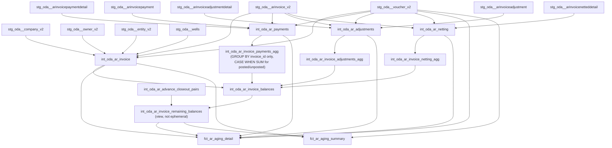

# feat: AR Aging Refactor — Intermediate Layer Redesign + New Fact Tables

## Enhancement Summary

**Deepened on:** 2026-02-18
**Research agents used:** data-integrity-guardian, performance-oracle, architecture-strategist
**Learnings applied:** inner-join-after-left-join-drops-null-rows.md, dbt-model-deletion-rename-procedure.md

### Critical Bugs Found During Deepening

1. **GROUP BY Fan-Out Bug** — The original plan proposed adding `is_invoice_posted`, `is_voucher_posted` to GROUP BY in the 3 agg models. This creates multiple rows per `invoice_id`, causing a fan-out in the balance model JOIN that silently double-counts financial amounts. **Fix: Keep GROUP BY on `invoice_id` only. Use `CASE WHEN inside SUM` to compute posted/unposted splits as separate columns.**

2. **UNION ALL in exclusion pairs** — Using UNION ALL for advance/closeout exclusion can produce duplicate `exclude_pair = 1` rows if an invoice appears multiple times, causing fan-out in the remaining_balances join. **Fix: Use `UNION` (deduplication) with NULL guards on both sides.**

3. **INNER JOIN in summary** — `fct_ar_aging_summary` INNER JOINs `remaining_balances`. If any invoice has no balance record due to future logic changes, it silently disappears from the aging report. **Fix: LEFT JOIN + not_null test.**

### New Deletions Added

- `int_oda_ar_all_details.sql` — sole consumer was `fct_ar_aging`; deleting both
- `selectors.yml` — must update `+fct_ar_aging` to `+fct_ar_aging_detail +fct_ar_aging_summary`

### Materialization Change

- `int_oda_ar_invoice_remaining_balances` → `view` (not `ephemeral`). Two materialized facts consume it; ephemeral cannot be independently inspected during validation of financially sensitive exclusion logic.

---

## Overview

Replace the current single `fct_ar_aging` with a redesigned AR aging pipeline that:

1. Removes the hard-coded `is_posted` filter from `int_oda_ar_invoice`, enabling **pre-JIB AR preview** alongside standard aging
2. Adds `is_invoice_posted` + `is_voucher_posted` flags throughout the pipeline using **conditional SUM splits** (not GROUP BY expansion)
3. Extracts advance/closeout exclusion logic into a dedicated `int_oda_ar_invoice_remaining_balances` model (materialized as `view`)
4. Creates two purpose-built facts: `fct_ar_aging_detail` (transaction-level) and `fct_ar_aging_summary` (invoice-level with aging buckets)
5. Retires `fct_ar_aging` + `int_oda_ar_all_details` (no consumers for either)

**Branch:** `feature/ar-aging-refactor`

---

## Problem Statement

The current `int_oda_ar_invoice` filters `WHERE i.is_posted = true`. This makes it impossible to analyze pre-JIB AR — unposted invoices representing upcoming billing that treasury and operations need to anticipate. Additionally, `fct_ar_aging` is a single flat view that mixes posted and unposted without distinguishing them, and the advance/closeout exclusion logic is buried inline in the balance calculation.

---

## Open Questions — Resolved

### Q1: Do detail models have their own `voucher_id`?

**Answer: YES.** Each detail model already joins `stg_oda__voucher_v2` on its OWN `voucher_id`:
- `int_oda_ar_payments` → `p.voucher_id` (payment's voucher)
- `int_oda_ar_adjustments` → `aria.voucher_id` (adjustment's voucher)
- `int_oda_ar_netting` → `nd.voucher_id` (netting detail's voucher)

**Implication:** No new joins needed. Simply remove the posted filter and expose `v.is_posted AS is_voucher_posted` in each model.

### Q2: Advance/closeout pair logic with unfiltered invoice base?

**Answer: Low risk now, verify when data appears.** `stg_oda__aradvancecloseout` currently has 0 rows. When data arrives, verify by comparing row counts before/after filter removal. With the posting filter removed from `int_oda_ar_invoice`, unposted closeouts may now match pairs — confirm with business whether unposted pairs should be excluded from aging.

### Q3: `include_record` at invoice level in summary?

**Answer: YES.** An invoice with `remaining_balance = 0` or `exclude_pair = true` has `include_record = false` in `fct_ar_aging_summary`.

### Q4: "Current" bucket definition?

**Answer:** `DATEDIFF(day, invoice_date, CURRENT_DATE()) <= 0` = Current (future-dated or today). Pre-JIB unposted invoices with future billing dates land here. This is intentional — they represent upcoming billing. Document explicitly in the model.

---

## Critical Sign Conventions (DO NOT CHANGE)

```sql
-- Balance formula (E2E validated against Snowflake data)
remaining_balance =
  invoice_amount          -- positive (amount billed)
  + total_payments        -- negative (amount_applied is negative in ODA)
  + total_adjustments     -- mixed sign (pass through unchanged)
  + total_net             -- negative (negate netted_amount: -nd.netted_amount)
```

- `amount_applied` (payments): **already negative** in ODA → no negation
- `adjustment_detail_amount` (adjustments): **mixed sign** → pass through
- `netted_amount` (netting): **positive** in ODA → **must negate**: `-nd.netted_amount`

---

## Implementation Plan

### Phase 0: Pre-Implementation Checks

```bash
# 1. Create branch
git checkout -b feature/ar-aging-refactor

# 2. Verify zero consumers of models being deleted
grep -r "ref('fct_ar_aging')" models/
grep -r "ref('int_oda_ar_all_details')" models/

# 3. Blast radius check — query Snowflake query_history for fct_ar_aging
# (same methodology used for los_v5_afe_v2 in Sprint 3b)
# Run in Snowflake:
# SELECT query_text, user_name, start_time
# FROM snowflake.account_usage.query_history
# WHERE query_text ilike '%fct_ar_aging%'
#   AND start_time > dateadd(day, -90, current_timestamp())
# ORDER BY start_time DESC;

# 4. Record baseline row counts for validation later
# dbt show --inline "select count(*) from {{ ref('int_oda_ar_invoice') }}" --limit 1
```

---

### Phase 1: Modify Existing Intermediates (8 models)

#### 1A: `int_oda_ar_invoice.sql`

**Changes:**
- Remove `WHERE i.is_posted = true`
- Add `LEFT JOIN {{ ref('stg_oda__voucher_v2') }} v ON i.voucher_id = v.id`
- Add to SELECT: `i.is_posted AS is_invoice_posted`, `v.is_posted AS is_voucher_posted`, `i.voucher_id`

```sql
-- REMOVE this WHERE clause entirely:
WHERE i.is_posted = true

-- ADD to SELECT list:
i.is_posted AS is_invoice_posted,
v.is_posted AS is_voucher_posted,
i.voucher_id,

-- ADD LEFT JOIN after existing joins:
LEFT JOIN {{ ref('stg_oda__voucher_v2') }} v ON i.voucher_id = v.id
```

**Validation:** Row count should INCREASE (now includes unposted invoices).

---

#### 1B: `int_oda_ar_payments.sql`

**Changes:**
- Remove `WHERE i.is_posted AND v.is_posted`
- Add to SELECT: `i.is_posted AS is_invoice_posted`, `v.is_posted AS is_voucher_posted`

> Note: `int_oda_ar_payments` already joins `stg_oda__voucher_v2` on `p.voucher_id`. Just expose the flag and remove the filter.

---

#### 1C: `int_oda_ar_adjustments.sql`

**Changes:**
- Remove `WHERE i.is_posted AND v.is_posted`
- Add to SELECT: `i.is_posted AS is_invoice_posted`, `v.is_posted AS is_voucher_posted`

> Note: `int_oda_ar_adjustments` already joins `stg_oda__voucher_v2` on `aria.voucher_id`. Just expose the flag and remove the filter.

---

#### 1D: `int_oda_ar_netting.sql`

**Changes:**
- Remove `WHERE i.is_posted` (netting currently only checks invoice, not voucher)
- Add LEFT JOIN to voucher on `nd.voucher_id` (netting detail has its own voucher_id)
- Add to SELECT: `i.is_posted AS is_invoice_posted`, `v.is_posted AS is_voucher_posted`

---

#### 1E: `int_oda_ar_invoice_payments_agg.sql` ⚠️ CRITICAL FIX

**DO NOT add `is_invoice_posted`, `is_voucher_posted` to GROUP BY.** That creates multiple rows per `invoice_id`, causing a fan-out in downstream JOINs.

**Instead: Use conditional SUM to split posted/unposted into separate columns.**

```sql
-- ✅ CORRECT PATTERN (one row per invoice_id, posted split via CASE WHEN):
SELECT
  invoice_id,
  SUM(total_invoice_amount) AS total_payments,
  SUM(CASE WHEN is_invoice_posted THEN total_invoice_amount ELSE 0 END) AS posted_payments,
  SUM(CASE WHEN NOT is_invoice_posted THEN total_invoice_amount ELSE 0 END) AS unposted_payments
FROM {{ ref('int_oda_ar_payments') }}
GROUP BY invoice_id

-- ❌ WRONG PATTERN (creates fan-out):
GROUP BY invoice_id, is_invoice_posted, is_voucher_posted
```

---

#### 1F: `int_oda_ar_invoice_adjustments_agg.sql` ⚠️ CRITICAL FIX

Same pattern as 1E:

```sql
SELECT
  invoice_id,
  SUM(total_invoice_amount) AS total_adjustments,
  SUM(CASE WHEN is_invoice_posted THEN total_invoice_amount ELSE 0 END) AS posted_adjustments,
  SUM(CASE WHEN NOT is_invoice_posted THEN total_invoice_amount ELSE 0 END) AS unposted_adjustments
FROM {{ ref('int_oda_ar_adjustments') }}
GROUP BY invoice_id
```

---

#### 1G: `int_oda_ar_invoice_netting_agg.sql` ⚠️ CRITICAL FIX

Same pattern:

```sql
SELECT
  invoice_id,
  SUM(total_invoice_amount) AS total_net,
  SUM(CASE WHEN is_invoice_posted THEN total_invoice_amount ELSE 0 END) AS posted_net,
  SUM(CASE WHEN NOT is_invoice_posted THEN total_invoice_amount ELSE 0 END) AS unposted_net
FROM {{ ref('int_oda_ar_netting') }}
GROUP BY invoice_id
```

---

#### 1H: `int_oda_ar_invoice_balances.sql`

**Changes:**
- Remove the advance/closeout exclusion subquery (moves to new `remaining_balances` model)
- Add posted/unposted balance split using the new conditional SUM columns from agg models

```sql
-- REMOVE this subquery:
LEFT JOIN (
  SELECT advance_invoice_id AS invoice_id, 1 AS exclude_pair
  FROM int_oda_ar_advance_closeout_pairs
  UNION ALL
  SELECT closeout_invoice_id AS invoice_id, 1 AS exclude_pair
  FROM int_oda_ar_advance_closeout_pairs
) m ON i.invoice_id = m.invoice_id

-- UPDATED SELECT using split columns:
SELECT
  i.invoice_id,
  i.is_invoice_posted,
  i.total_invoice_amount,
  COALESCE(p.total_payments, 0)     AS total_payments,
  COALESCE(a.total_adjustments, 0)  AS total_adjustments,
  COALESCE(n.total_net, 0)          AS total_net,
  i.total_invoice_amount
    + COALESCE(p.total_payments, 0)
    + COALESCE(a.total_adjustments, 0)
    + COALESCE(n.total_net, 0)
  AS remaining_balance,
  -- Posted-only balance (for JIB comparison)
  CASE WHEN i.is_invoice_posted THEN i.total_invoice_amount ELSE 0 END
    + COALESCE(p.posted_payments, 0)
    + COALESCE(a.posted_adjustments, 0)
    + COALESCE(n.posted_net, 0)
  AS remaining_balance_posted,
  -- Unposted balance (pre-JIB preview)
  CASE WHEN NOT i.is_invoice_posted THEN i.total_invoice_amount ELSE 0 END
    + COALESCE(p.unposted_payments, 0)
    + COALESCE(a.unposted_adjustments, 0)
    + COALESCE(n.unposted_net, 0)
  AS remaining_balance_unposted
FROM {{ ref('int_oda_ar_invoice') }} i
LEFT JOIN {{ ref('int_oda_ar_invoice_payments_agg') }}    p ON i.invoice_id = p.invoice_id
LEFT JOIN {{ ref('int_oda_ar_invoice_adjustments_agg') }} a ON i.invoice_id = a.invoice_id
LEFT JOIN {{ ref('int_oda_ar_invoice_netting_agg') }}     n ON i.invoice_id = n.invoice_id
```

---

### Phase 2: Create New Intermediates (1 model)

#### 2A: `int_oda_ar_invoice_remaining_balances.sql`

**Materialization: `view` (not ephemeral)** — Two materialized facts consume this; ephemeral cannot be independently inspected during validation. Advance/closeout exclusion is financially sensitive logic that must be verifiable via `dbt show`.

```sql
{{
    config(materialized='view')
}}

WITH balances AS (
    SELECT
        invoice_id,
        is_invoice_posted,
        remaining_balance,
        remaining_balance_posted,
        remaining_balance_unposted
    FROM {{ ref('int_oda_ar_invoice_balances') }}
),

-- ⚠️ Use UNION (not UNION ALL) to deduplicate — an invoice appearing multiple
-- times in advance_closeout_pairs would fan-out the LEFT JOIN if UNION ALL is used.
-- NULL guards prevent unmatched LEFT JOIN rows from entering the exclusion set.
excluded_invoice_ids AS (
    SELECT advance_invoice_id AS invoice_id
    FROM {{ ref('int_oda_ar_advance_closeout_pairs') }}
    WHERE advance_invoice_id IS NOT NULL

    UNION  -- deduplicate

    SELECT closeout_invoice_id AS invoice_id
    FROM {{ ref('int_oda_ar_advance_closeout_pairs') }}
    WHERE closeout_invoice_id IS NOT NULL
),

final AS (
    SELECT
        b.invoice_id,
        b.is_invoice_posted,
        b.remaining_balance,
        b.remaining_balance_posted,
        b.remaining_balance_unposted,
        CASE WHEN e.invoice_id IS NOT NULL THEN 1 ELSE 0 END AS exclude_pair,
        CASE
            WHEN b.remaining_balance != 0
                AND (e.invoice_id IS NULL)
            THEN 1
            ELSE 0
        END AS include_record
    FROM balances b
    LEFT JOIN excluded_invoice_ids e ON b.invoice_id = e.invoice_id
)

SELECT * FROM final
```

**Output columns:** `invoice_id`, `is_invoice_posted`, `remaining_balance`, `remaining_balance_posted`, `remaining_balance_unposted`, `exclude_pair`, `include_record`

---

### Phase 3: Create New Fact Tables (2 models)

#### 3A: `fct_ar_aging_detail.sql`

**File:** `models/operations/marts/finance/fct_ar_aging_detail.sql`

**Grain:** One row per transaction (invoice + all payment/adjustment/netting rows)

**Materialization:** `table`

> Note: `remaining_balance` and `include_record` are invoice-level attributes repeated on every transaction row for that invoice. This is intentional — consumers can filter transactions for a given invoice using `include_record = 1` without needing a separate join. The ~1.3M redundant JOIN rows are negligible at this scale.

```sql
{{
    config(
        materialized='table',
        tags=['marts', 'facts']
    )
}}

WITH invoices AS (
    SELECT
        invoice_id,
        company_code,
        company_name,
        owner_id,
        owner_code,
        owner_name,
        well_id,
        well_code,
        well_name,
        invoice_number,
        invoice_type_id,
        voucher_id,
        invoice_date AS transaction_date,
        total_invoice_amount AS transaction_amount,
        invoice_description AS transaction_reference,
        invoice_type AS transaction_type,
        is_invoice_posted,
        is_voucher_posted,
        hold_billing,
        sort_order,
        'invoice' AS transaction_source
    FROM {{ ref('int_oda_ar_invoice') }}
),

payments AS (
    SELECT
        invoice_id,
        company_code,
        company_name,
        owner_id,
        owner_code,
        owner_name,
        well_id,
        well_code,
        well_name,
        invoice_number,
        invoice_type_id,
        voucher_id,
        invoice_date AS transaction_date,
        total_invoice_amount AS transaction_amount,
        invoice_description AS transaction_reference,
        invoice_type AS transaction_type,
        is_invoice_posted,
        is_voucher_posted,
        hold_billing,
        sort_order,
        'payment' AS transaction_source
    FROM {{ ref('int_oda_ar_payments') }}
),

adjustments AS (
    SELECT
        invoice_id,
        company_code,
        company_name,
        owner_id,
        owner_code,
        owner_name,
        well_id,
        well_code,
        well_name,
        invoice_number,
        invoice_type_id,
        voucher_id,
        invoice_date AS transaction_date,
        total_invoice_amount AS transaction_amount,
        invoice_description AS transaction_reference,
        invoice_type AS transaction_type,
        is_invoice_posted,
        is_voucher_posted,
        hold_billing,
        sort_order,
        'adjustment' AS transaction_source
    FROM {{ ref('int_oda_ar_adjustments') }}
),

netting AS (
    SELECT
        invoice_id,
        company_code,
        company_name,
        owner_id,
        owner_code,
        owner_name,
        well_id,
        well_code,
        well_name,
        invoice_number,
        invoice_type_id,
        voucher_id,
        invoice_date AS transaction_date,
        total_invoice_amount AS transaction_amount,
        invoice_description AS transaction_reference,
        invoice_type AS transaction_type,
        is_invoice_posted,
        is_voucher_posted,
        hold_billing,
        sort_order,
        'netting' AS transaction_source
    FROM {{ ref('int_oda_ar_netting') }}
),

all_transactions AS (
    SELECT * FROM invoices
    UNION ALL
    SELECT * FROM payments
    UNION ALL
    SELECT * FROM adjustments
    UNION ALL
    SELECT * FROM netting
),

remaining_balances AS (
    SELECT * FROM {{ ref('int_oda_ar_invoice_remaining_balances') }}
),

vouchers AS (
    SELECT id AS voucher_id, code AS voucher_number
    FROM {{ ref('stg_oda__voucher_v2') }}
),

final AS (
    SELECT
        t.invoice_id,
        t.transaction_source,
        t.company_code,
        t.company_name,
        t.owner_id,
        t.owner_code,
        t.owner_name,
        t.well_id,
        t.well_code,
        t.well_name,
        t.invoice_number,
        t.invoice_type_id,
        t.voucher_id,
        v.voucher_number,
        t.transaction_date,
        REPLACE(t.transaction_reference, '   ', '') AS transaction_reference,
        t.transaction_type,
        t.transaction_amount AS balance_due,
        rb.remaining_balance,
        rb.remaining_balance_posted,
        rb.remaining_balance_unposted,
        rb.exclude_pair,
        rb.include_record,
        t.is_invoice_posted,
        t.is_voucher_posted,
        t.hold_billing,
        t.sort_order
    FROM all_transactions t
    LEFT JOIN remaining_balances rb ON t.invoice_id = rb.invoice_id
    LEFT JOIN vouchers v ON t.voucher_id = v.voucher_id
)

SELECT * FROM final
```

---

#### 3B: `fct_ar_aging_summary.sql`

**File:** `models/operations/marts/finance/fct_ar_aging_summary.sql`

**Grain:** One row per invoice

**Materialization:** `table`

> ⚠️ Uses LEFT JOIN (not INNER JOIN) to `remaining_balances` — see inner-join-after-left-join-drops-null-rows.md learning. An INNER JOIN here would silently drop invoices if the balance model ever changes. The not_null test on `remaining_balance` makes this explicit and detectable.

```sql
{{
    config(
        materialized='table',
        tags=['marts', 'facts']
    )
}}

WITH invoice_base AS (
    SELECT
        invoice_id,
        invoice_number,
        company_code,
        company_name,
        owner_id,
        owner_code,
        owner_name,
        well_id,
        well_code,
        well_name,
        invoice_date,
        total_invoice_amount,
        invoice_type_id,
        invoice_type,
        invoice_description,
        voucher_id,
        is_invoice_posted,
        is_voucher_posted,
        hold_billing
    FROM {{ ref('int_oda_ar_invoice') }}
),

remaining_balances AS (
    SELECT * FROM {{ ref('int_oda_ar_invoice_remaining_balances') }}
),

vouchers AS (
    SELECT id AS voucher_id, code AS voucher_number
    FROM {{ ref('stg_oda__voucher_v2') }}
),

final AS (
    SELECT
        i.invoice_id,
        i.invoice_number,
        i.company_code,
        i.company_name,
        i.owner_id,
        i.owner_code,
        i.owner_name,
        i.well_id,
        i.well_code,
        i.well_name,
        i.invoice_date,
        i.total_invoice_amount,
        i.invoice_type_id,
        i.invoice_type,
        REPLACE(i.invoice_description, '   ', '') AS invoice_description,
        i.voucher_id,
        v.voucher_number,
        i.is_invoice_posted,
        i.is_voucher_posted,
        i.hold_billing,
        rb.remaining_balance,
        rb.remaining_balance_posted,
        rb.remaining_balance_unposted,
        rb.exclude_pair,
        rb.include_record,

        -- Days past due (as of today)
        DATEDIFF(day, i.invoice_date, CURRENT_DATE()) AS days_past_due,

        -- Standard AR aging buckets
        -- "Current" = future-dated or today (pre-JIB unposted invoices land here)
        CASE
            WHEN DATEDIFF(day, i.invoice_date, CURRENT_DATE()) <= 0
                THEN rb.remaining_balance ELSE 0
        END AS current_balance,
        CASE
            WHEN DATEDIFF(day, i.invoice_date, CURRENT_DATE()) BETWEEN 1 AND 30
                THEN rb.remaining_balance ELSE 0
        END AS balance_1_30_days,
        CASE
            WHEN DATEDIFF(day, i.invoice_date, CURRENT_DATE()) BETWEEN 31 AND 60
                THEN rb.remaining_balance ELSE 0
        END AS balance_31_60_days,
        CASE
            WHEN DATEDIFF(day, i.invoice_date, CURRENT_DATE()) BETWEEN 61 AND 90
                THEN rb.remaining_balance ELSE 0
        END AS balance_61_90_days,
        CASE
            WHEN DATEDIFF(day, i.invoice_date, CURRENT_DATE()) > 90
                THEN rb.remaining_balance ELSE 0
        END AS balance_90_plus_days
    FROM invoice_base i
    LEFT JOIN remaining_balances rb ON i.invoice_id = rb.invoice_id  -- LEFT, not INNER
    LEFT JOIN vouchers v ON i.voucher_id = v.voucher_id
)

SELECT * FROM final
```

---

### Phase 4: Retire Models

```bash
# Delete retiring models
git rm models/operations/marts/finance/fct_ar_aging.sql
git rm models/operations/intermediate/finance/int_oda_ar_all_details.sql

# Update selectors.yml: replace +fct_ar_aging with two new facts
# (edit selectors.yml manually or via sed)
```

**Verify zero consumers first:**
```bash
grep -r "ref('fct_ar_aging')" models/
grep -r "ref('int_oda_ar_all_details')" models/
```

**Post-merge Snowflake cleanup** (run in Snowflake after PR merge — dbt does NOT auto-drop objects):
```sql
-- Drop orphaned views from deleted models
DROP VIEW IF EXISTS FO_STAGE_DB.INTERMEDIATE.INT_ODA_AR_ALL_DETAILS;
DROP TABLE IF EXISTS FO_DEV_DB.MARTS.FCT_AR_AGING;
```

---

### Phase 5: YAML Documentation

#### 5A: Create `_int_oda_finance.yml` (new)

**File:** `models/operations/intermediate/finance/_int_oda_finance.yml`

Document all modified intermediates + new `int_oda_ar_invoice_remaining_balances` with:
- Model description
- Column descriptions for new flags (`is_invoice_posted`, `is_voucher_posted`) and new split columns (`posted_payments`, `unposted_payments`, etc.)

> Note: Since `int_oda_ar_invoice_remaining_balances` is now a `view` (not ephemeral), it CAN have `data_tests` — add a `not_null` on `invoice_id`.

#### 5B: Update `schema.yml` in finance marts

Add YAML entries for `fct_ar_aging_detail` and `fct_ar_aging_summary`:

```yaml
- name: fct_ar_aging_detail
  description: >
    Transaction-level AR aging fact. One row per transaction (invoice, payment,
    adjustment, or netting). Includes is_invoice_posted and is_voucher_posted
    flags enabling pre-JIB analysis alongside standard posted AR aging.
    remaining_balance and include_record are invoice-level attributes repeated
    on every transaction row for that invoice for consumer convenience.
  columns:
    - name: invoice_id
      description: FK to arinvoice_v2 — identifies the parent invoice
      data_tests:
        - not_null
    - name: transaction_source
      description: "One of: invoice, payment, adjustment, netting"
      data_tests:
        - not_null
    - name: is_invoice_posted
      description: True when the invoice itself is posted in ODA
      data_tests:
        - not_null
    - name: is_voucher_posted
      description: True when the voucher (batch run) for this specific transaction is posted
    - name: include_record
      description: >
        1 when remaining_balance != 0 AND exclude_pair = 0. Use to filter
        to actionable outstanding AR transactions.
      data_tests:
        - not_null
    - name: remaining_balance
      description: Total remaining balance on the parent invoice (posted + unposted)
    - name: remaining_balance_posted
      description: Posted-only balance component — use for JIB comparison
    - name: remaining_balance_unposted
      description: Unposted-only balance — use for pre-JIB preview

- name: fct_ar_aging_summary
  description: >
    Invoice-level AR aging summary with standard aging bucket columns.
    One row per invoice. Includes posted/unposted balance split and
    include_record flag for filtering actionable invoices.
    "Current" bucket = invoice date is today or in the future (days_past_due <= 0).
    Pre-JIB unposted invoices with future billing dates land in current_balance.
  data_tests:
    - dbt_utils.expression_is_true:
        arguments:
          expression: "remaining_balance is not null"
        config:
          severity: error
          error_msg: "Every invoice must have a remaining_balance — check int_oda_ar_invoice_remaining_balances for missing invoice_ids"
  columns:
    - name: invoice_id
      description: PK — unique per invoice
      data_tests:
        - unique
        - not_null
    - name: remaining_balance
      description: Invoice amount + payments + adjustments + netting (additive formula, validated E2E)
      data_tests:
        - not_null
    - name: include_record
      description: >
        1 when remaining_balance != 0 AND exclude_pair = 0. Filter on this
        for standard AR aging reports.
      data_tests:
        - not_null
    - name: days_past_due
      description: DATEDIFF(day, invoice_date, CURRENT_DATE()). Negative for future-dated invoices.
    - name: current_balance
      description: Balance for invoices not yet past due (days_past_due <= 0)
    - name: balance_1_30_days
      description: Balance for invoices 1-30 days past due (BETWEEN 1 AND 30, inclusive)
    - name: balance_31_60_days
      description: Balance for invoices 31-60 days past due
    - name: balance_61_90_days
      description: Balance for invoices 61-90 days past due
    - name: balance_90_plus_days
      description: Balance for invoices more than 90 days past due (> 90, no upper bound)
```

#### 5C: Update `selectors.yml`

Replace `+fct_ar_aging` with `+fct_ar_aging_detail` and `+fct_ar_aging_summary` in the `marts-finance` (or equivalent) selector.

---

## Validation Plan

Run these checks in order after all code is written:

```bash
# 1. Parse check — zero errors, zero warnings
dbt parse --warn-error --no-partial-parse

# 2. Verify deletion is safe (should return no results)
grep -r "ref('fct_ar_aging')" models/
grep -r "ref('int_oda_ar_all_details')" models/

# 3. Build the full AR graph
dbt build --select int_oda_ar_invoice+

# 4. Verify row count INCREASED in invoice base (now includes unposted)
dbt show --inline "select count(*) as n from {{ ref('int_oda_ar_invoice') }}" --limit 1

# 5. Verify agg models remain at ONE row per invoice_id (critical fan-out check)
dbt show --inline "
  select invoice_id, count(*) as n
  from {{ ref('int_oda_ar_invoice_payments_agg') }}
  group by invoice_id
  having count(*) > 1
  limit 10
" --limit 10
# Should return zero rows

# 6. Inspect remaining_balances intermediate (possible since it's a view now)
dbt show --select int_oda_ar_invoice_remaining_balances --limit 20

# 7. Netting sign spot-check
# For any invoice with netting, confirm: remaining_balance ≈ invoice_amount - |netted_amount|

# 8. Aging bucket sanity check
dbt show --select fct_ar_aging_summary --limit 20

# 9. Summary row count ≈ distinct invoice count from stg_oda__arinvoice_v2
dbt show --inline "select count(*) as n from {{ ref('fct_ar_aging_summary') }}" --limit 1
dbt show --inline "select count(*) as n from {{ ref('stg_oda__arinvoice_v2') }}" --limit 1

# 10. Structural linter (mart models only — staging linter doesn't apply to intermediates/marts)
python scripts/validate_staging.py models/operations/marts/finance/fct_ar_aging_detail.sql
python scripts/validate_staging.py models/operations/marts/finance/fct_ar_aging_summary.sql
```

---

## File Change Summary

| Action | File |
|--------|------|
| Modify | `models/operations/intermediate/finance/int_oda_ar_invoice.sql` |
| Modify | `models/operations/intermediate/finance/int_oda_ar_payments.sql` |
| Modify | `models/operations/intermediate/finance/int_oda_ar_adjustments.sql` |
| Modify | `models/operations/intermediate/finance/int_oda_ar_netting.sql` |
| Modify | `models/operations/intermediate/finance/int_oda_ar_invoice_payments_agg.sql` |
| Modify | `models/operations/intermediate/finance/int_oda_ar_invoice_adjustments_agg.sql` |
| Modify | `models/operations/intermediate/finance/int_oda_ar_invoice_netting_agg.sql` |
| Modify | `models/operations/intermediate/finance/int_oda_ar_invoice_balances.sql` |
| Create | `models/operations/intermediate/finance/int_oda_ar_invoice_remaining_balances.sql` |
| Create | `models/operations/marts/finance/fct_ar_aging_detail.sql` |
| Create | `models/operations/marts/finance/fct_ar_aging_summary.sql` |
| Create | `models/operations/intermediate/finance/_int_oda_finance.yml` |
| Update | `models/operations/marts/finance/schema.yml` |
| Update | `selectors.yml` |
| Delete | `models/operations/marts/finance/fct_ar_aging.sql` |
| Delete | `models/operations/intermediate/finance/int_oda_ar_all_details.sql` |

**Total:** 8 modified, 4 created, 2 updated, 2 deleted = **16 files touched**

---

## DAG Diagram



---

## Dependencies & Risks

| Risk | Severity | Mitigation |
|------|----------|------------|
| GROUP BY fan-out in agg models | ~~Critical~~ → **Fixed** | Use conditional SUM, GROUP BY invoice_id only |
| UNION ALL in exclusion pairs fans out | ~~Moderate~~ → **Fixed** | Use UNION (dedup) + NULL guards |
| INNER JOIN in summary drops rows | ~~Low~~ → **Fixed** | LEFT JOIN + not_null test |
| Removing posted filter increases row count — downstream apps may not expect unposted rows | Moderate | Explicit flags on every row; consumers filter on `is_invoice_posted = true` |
| `int_oda_ar_advance_closeout_pairs` pairing with unfiltered invoice base | Low (0 rows now) | Run advance/closeout count check after filter removal; verify with business when data appears |
| `selectors.yml` references deleted `fct_ar_aging` | Low | Update selectors.yml in same commit — already in file change list |
| Orphaned Snowflake objects after deletion | Low | Post-merge DROP script in validation plan |

---

## References

- **Brainstorm:** `docs/brainstorms/2026-02-18-ar-aging-refactor-brainstorm.md`
- **AR solutions:** `docs/solutions/refactoring/oda-staging-sprint-5-ar-patterns.md`
- **Fact patterns:** `docs/solutions/refactoring/drilling-mart-sprint-2-fact-table-patterns.md`
- **Intermediate conventions:** `docs/conventions/intermediate.md`
- **Mart conventions:** `docs/conventions/marts.md`
- **UNION ALL column order:** `docs/solutions/build-errors/oda-wells-text-enum-cast-and-ar-union-column-order.md`
- **Inner join after left join:** `docs/solutions/logic-errors/inner-join-after-left-join-drops-null-rows.md`
- **Model deletion procedure:** `docs/solutions/build-errors/dbt-model-deletion-rename-procedure.md`
