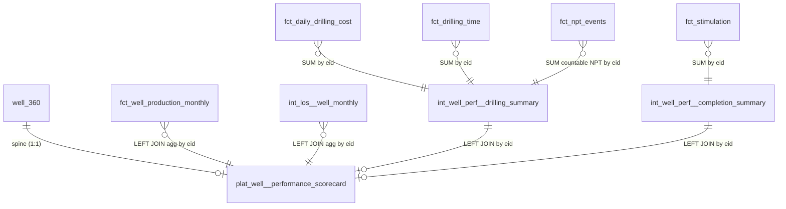

# Well Performance Mart Sprint 2 — Platinum Scorecard OBT

## Enhancement Summary

**Deepened:** 2026-02-19
**Review agents:** data-integrity-guardian, performance-oracle, architecture-strategist, code-simplicity-reviewer, deployment-verification-agent, learnings-researcher

### Critical Fixes Discovered (Would Have Been Silent Bugs)

1. **`has_los_data` flag is wrong without COALESCE** — `months_with_los_count > 0` evaluates to `NULL` (not `false`) after a LEFT JOIN that finds no rows. Must use `coalesce(l.months_with_los_count, 0) > 0` or `l.eid IS NOT NULL`.
2. **`SELECT *` from `well_360` violates hard rules** and creates `lateral_length_ft` column name collision. Must enumerate columns explicitly.
3. **EID trim guard on `int_los__well_monthly`** — `right(well_code, 6)` silently produces non-matching EIDs if `well_code` has trailing spaces. Add `right(trim(well_code), 6)` and a `len >= 6` guard.
4. **Unresolved production rows** — `fct_well_production_monthly` has `is_eid_unresolved = true` rows (eid IS NULL) for ~18.5% of unit-months. Add explicit `WHERE eid IS NOT NULL` in the platinum production CTE.
5. **NPT% can exceed 100%** — overlapping NPT events produce impossible rates in BI. Add `LEAST(npt_pct, 1.0)` cap + `is_npt_anomaly` flag.
6. **`proppant_per_ft_lb` wrong denominator** — `SUM(stim.length_gross_ft)` overstates for re-stimulations. Use `well_360.lateral_length_ft` as denominator (compute ratio in platinum final CTE, not in the intermediate).
7. **`fct_daily_drilling_cost` cluster key mismatch** — table clusters on `['well_id', 'job_id']` but drilling intermediate queries by `eid`. Recluster to `['eid', 'job_id']`.

### Performance Improvements

- **Search Optimization** post-hook on platinum (not clustering — 9-15K rows fits in one micro-partition)
- **`MAX_BY(production_month, gross_boe)`** confirmed as optimal (single-pass, no window sort)
- Platinum CTE nesting is 3 levels deep — within Snowflake limits, no concern

### Architecture Decisions (Confirmed / Revised)

- ✅ Keep drilling + completion ephemeral intermediates (3 source joins each — threshold met)
- ✅ Aggregate LOS and production inline in platinum (already exists as int_los__well_monthly, single consumer for the re-aggregation)
- ✅ No surrogate key on platinum — `eid` is the natural PK
- ✅ No interface layer between gold facts and platinum
- ⚠️ The plan listed `int_well_perf__prodview_monthly` in Files Touched — DROP THIS. It was erroneously added; `fct_well_production_monthly` is referenced directly in platinum.

---

## Overview

Sprint 2 delivers the platinum layer of the Well Performance Data Asset: `plat_well__performance_scorecard`, a fully-denormalized OBT (one big table) at the EID grain combining production, financials, drilling, and completions data. This is the primary BI consumption surface for well-level lifetime performance analysis.

Sprint 1 built the gold layer (galaxy schema + production fact). Sprint 2 adds two ephemeral intermediates, the platinum OBT, YAML docs, and closes out all three Linear issues.

## Architecture

```
well_360 (canonical dim, spine)
  ├── fct_well_production_monthly (gold, 762K rows)  ← agg inline in plat
  ├── int_los__well_monthly (ephemeral, (eid, month) grain) ← agg inline in plat
  ├── int_well_perf__drilling_summary (NEW ephemeral, eid grain) ← pre-agg
  └── int_well_perf__completion_summary (NEW ephemeral, eid grain) ← pre-agg
                          ↓
         plat_well__performance_scorecard (NEW, table, eid grain)
         FO_PRODUCTION_DB.platinum (prod) / dbt_rob_stover (dev)
```

**Design decisions:**
- `int_los__well_monthly` is at (eid, month) grain — aggregate inline in the platinum CTE (no new intermediate needed, simple SUM + COUNT)
- `fct_well_production_monthly` is at (eid, month) grain — aggregate inline in platinum (use `MAX_BY` for peak month)
- Two new ephemeral intermediates needed: drilling (3 source facts) and completion (1 source with multiple stim jobs per EID)
- `eid` is the natural PK of the platinum — no surrogate key
- `proppant_per_ft_lb` computed in the platinum `final` CTE using `well_360.lateral_length_ft` as denominator (not stim interval length)

## Prerequisites

- ✅ Sprint 1 merged to main (PR #288)
- ✅ `well_360` canonical dim evolution merged (PR #287) — provides `basin_name`, `oda_well_id`, `activity_status`, `well_type_oda`, etc.
- ✅ `models/operations/platinum/well_360/` directory exists
- ⚠️ `dbt_project.yml` platinum config block was intentionally removed in Sprint 1 — must be re-added

---

## Implementation Plan

### Task 1: Restore Platinum Config in dbt_project.yml (FOR-305 prerequisite)

**File:** `dbt_project.yml`

Add after the `griffin:` block (line ~80), before `# Applications models` comment:

```yaml
      # Platinum models - denormalized OBT, consumption-ready for BI
      platinum:
        +database: "{{ {'prod': 'FO_PRODUCTION_DB', 'ci': 'FO_CI_DB', 'dev': target.database}.get(target.name, target.database) }}"
        +schema: "{{ target.schema if target.name in ['ci', 'dev'] else 'platinum' }}"
        +materialized: table
        +tags: ["platinum", "fo"]
```

Confirm correct position:
```bash
grep -A 5 "platinum:" dbt_project.yml  # should show FO_PRODUCTION_DB + platinum schema routing
```

**Validation:** `dbt parse --warn-error --no-partial-parse` (will only pass once a model exists in `models/operations/platinum/`)

---

### Task 2: int_well_perf__drilling_summary (FOR-305)

**File:** `models/operations/intermediate/well_360/int_well_perf__drilling_summary.sql`

**Grain:** eid (one row per well, lifetime aggregate across all jobs)
**Materialization:** ephemeral

**Sources:**
- `fct_daily_drilling_cost` → `eid`, `job_id`, `field_estimate_cost`
- `fct_drilling_time` → `eid`, `job_id`, `duration_hours`
- `fct_npt_events` → `eid`, `problem_duration_gross_hours`, `is_countable_npt`

**Key design notes (post-review):**
- Merge `drilling_time` and `npt_events` into a single CTE (both from the same table family, can use conditional SUM)
- Use `FULL OUTER JOIN` between `drilling_cost` and `drilling_time` so wells with time data but no cost lines are not dropped
- `npt_pct` capped at 1.0 (`LEAST(..., 1.0)`) — NPT entries can overlap and produce > 100% without a cap
- Add `is_npt_anomaly` flag when raw NPT > drilling hours
- `job_count` comes from `drilling_cost` (invoicing-driven, most complete source)

**Output columns:**
| Column | Source | Calculation |
|--------|--------|-------------|
| `eid` | COALESCE of all three sources | GROUP BY key |
| `drilling_job_count` | fct_daily_drilling_cost | COUNT(DISTINCT job_id) |
| `total_dc_cost` | fct_daily_drilling_cost | SUM(field_estimate_cost) |
| `total_drilling_hours` | fct_drilling_time | SUM(duration_hours) |
| `total_npt_hours` | fct_npt_events | SUM(problem_duration_gross_hours) WHERE is_countable_npt |
| `npt_pct` | computed | LEAST(total_npt_hours / NULLIF(total_drilling_hours, 0), 1.0) |
| `is_npt_anomaly` | computed | total_npt_hours > total_drilling_hours |

```sql
-- models/operations/intermediate/well_360/int_well_perf__drilling_summary.sql
{#
  ARCHITECTURAL NOTE:
  This intermediate aggregates three gold-layer facts directly:
    - fct_daily_drilling_cost (incremental, merge on cost_line_id)
    - fct_drilling_time (full-rebuild table)
    - fct_npt_events (full-rebuild table)

  These facts have different refresh strategies. Do NOT attempt to make this
  model or plat_well__performance_scorecard incremental without reviewing
  the mixed refresh dependencies of the upstream facts.

  If any of these facts changes grain, re-validate this model's SUM logic.
  The unique(eid) test on plat_well__performance_scorecard will catch fan-out.
#}

{{
    config(
        materialized='ephemeral'
    )
}}

with drilling_cost as (
    select
        eid,
        count(distinct job_id) as drilling_job_count,
        sum(field_estimate_cost) as total_dc_cost
    from {{ ref('fct_daily_drilling_cost') }}
    where eid is not null
    group by eid
),

drilling_time_and_npt as (
    -- Merge time log and NPT into one pass (both from WellView job time log)
    -- NPT hours filtered to countable events via the is_countable_npt flag
    select
        eid,
        sum(duration_hours) as total_drilling_hours,
        sum(
            case when is_countable_npt then problem_duration_gross_hours else 0 end
        ) as total_npt_hours
    from {{ ref('fct_npt_events') }}
    where eid is not null
    group by eid
),

final as (
    select
        -- COALESCE ensures wells with time data but no cost records are retained
        coalesce(dc.eid, dt.eid) as eid,

        -- Job count from cost fact (most complete — invoicing-driven)
        coalesce(dc.drilling_job_count, 0) as drilling_job_count,
        coalesce(dc.total_dc_cost, 0) as total_dc_cost,

        -- Hours from time log fact (operational data — may have different job coverage)
        coalesce(dt.total_drilling_hours, 0) as total_drilling_hours,
        coalesce(dt.total_npt_hours, 0) as total_npt_hours,

        -- NPT rate capped at 100% — overlapping events can sum above total clock time
        least(
            coalesce(dt.total_npt_hours, 0) / nullif(coalesce(dt.total_drilling_hours, 0), 0),
            1.0
        ) as npt_pct,

        -- Data quality flag: raw NPT exceeds total drilling hours (inspect manually)
        coalesce(dt.total_npt_hours, 0) > coalesce(dt.total_drilling_hours, 0) as is_npt_anomaly
    from drilling_cost dc
    full outer join drilling_time_and_npt dt on dc.eid = dt.eid
)

select * from final
```

> **Note on fct_drilling_time join:** The plan originally joined `fct_drilling_time` for `duration_hours`. Verify whether `problem_duration_gross_hours` lives in `fct_npt_events` or `fct_drilling_time` and adjust the single CTE accordingly. The key is: one source table for time, one for NPT — merge if they're the same table, keep separate if different.

**Validation:** `dbt show --select int_well_perf__drilling_summary --limit 10`

---

### Task 3: int_well_perf__completion_summary (FOR-305)

**File:** `models/operations/intermediate/well_360/int_well_perf__completion_summary.sql`

**Grain:** eid (one row per well, aggregate across all stim jobs)
**Materialization:** ephemeral

**Source:** `fct_stimulation` — `eid`, `actual_total_stages`, `proppant_total_calc_lb`, `volume_clean_total_calc_bbl`, `length_gross_ft`

**Key design notes (post-review):**
- `proppant_per_ft_lb` NOT computed here — the correct denominator is `well_360.lateral_length_ft` (fixed well measurement), not `SUM(stim.length_gross_ft)` which overstates for re-stimulations
- Carry `stim_lateral_length_ft` as an audit column; the intensity ratio is computed in the platinum final CTE
- Multiple stim jobs per EID are possible — SUM stages, proppant, volume across all

**Output columns:**
| Column | Source | Calculation |
|--------|--------|-------------|
| `eid` | fct_stimulation | GROUP BY key |
| `stim_job_count` | fct_stimulation | COUNT(DISTINCT job_id) |
| `total_stages` | fct_stimulation | SUM(actual_total_stages) |
| `total_proppant_lb` | fct_stimulation | SUM(proppant_total_calc_lb) |
| `total_clean_volume_bbl` | fct_stimulation | SUM(volume_clean_total_calc_bbl) |
| `stim_lateral_length_ft` | fct_stimulation | SUM(length_gross_ft) — audit only, do NOT use as denominator for intensity |

```sql
-- models/operations/intermediate/well_360/int_well_perf__completion_summary.sql

{{
    config(
        materialized='ephemeral'
    )
}}

with source as (
    select
        eid,
        job_id,
        actual_total_stages,
        proppant_total_calc_lb,
        volume_clean_total_calc_bbl,
        length_gross_ft
    from {{ ref('fct_stimulation') }}
    where eid is not null
),

aggregated as (
    select
        eid,
        count(distinct job_id) as stim_job_count,
        sum(actual_total_stages) as total_stages,
        sum(proppant_total_calc_lb) as total_proppant_lb,
        sum(volume_clean_total_calc_bbl) as total_clean_volume_bbl,
        -- Audit only: stimulated interval per job, summed across all jobs
        -- Use well_360.lateral_length_ft for intensity calculations (fixed well measurement)
        sum(length_gross_ft) as stim_lateral_length_ft
    from source
    group by eid
),

final as (
    select * from aggregated
)

select * from final
```

**Validation:** `dbt show --select int_well_perf__completion_summary --limit 10`

---

### Task 4: plat_well__performance_scorecard (FOR-306)

**File:** `models/operations/platinum/well_360/plat_well__performance_scorecard.sql`

**Grain:** eid — one row per well, lifetime
**Materialization:** table
**Tags:** `['platinum', 'fo', 'well_360']`
**PK:** `eid` (natural key, no surrogate)

**CTE structure:**
1. `well_spine` — EXPLICIT column list from `well_360` (NOT `SELECT *`)
2. `production_aggs` — aggregate `fct_well_production_monthly` to eid grain (explicit `WHERE eid IS NOT NULL`)
3. `los_aggs` — aggregate `int_los__well_monthly` to eid grain
4. `drilling` — reference `int_well_perf__drilling_summary` (already eid grain, ephemeral)
5. `completion` — reference `int_well_perf__completion_summary` (already eid grain, ephemeral)
6. `final` — LEFT JOIN all aggregates onto `well_spine`

**Explicit column list from well_360 (not SELECT *):**
```sql
well_spine as (
    select
        eid,
        oda_well_id,
        api_10,
        api_14,
        well_name,
        cost_center_number,
        company_name,
        operator_name,
        is_operated,
        op_ref,
        basin_name,
        state,
        county,
        -- Alias lateral_length_ft to avoid collision with stim intermediate
        lateral_length_ft as well_lateral_length_ft,
        unified_status as wellbore_status,
        activity_status,
        spud_date,
        first_production_date,
        well_type_oda,
        well_configuration_type,
        is_revenue_generating,
        is_hold_billing,
        is_suspend_revenue,
        is_well,
        operating_group_name,
        cost_center_type_name,
        search_key,
        pv_field,
        in_oda,
        in_prodview,
        in_wellview,
        in_combo_curve
    from {{ ref('well_360') }}
),
```

**Production aggregates (with explicit unresolved-row exclusion):**
```sql
production_aggs as (
    -- NOTE: ~18.5% of unit-months in this fact have eid IS NULL (is_eid_unresolved = true)
    -- These are ProdView units without a well_360 match. Excluded intentionally.
    -- Monitor with: SELECT count(*) FROM fct_well_production_monthly WHERE is_eid_unresolved
    select
        eid,
        sum(oil_bbls)                                             as cumulative_oil_bbls,
        sum(gas_mcf)                                              as cumulative_gas_mcf,
        sum(water_bbls)                                           as cumulative_water_bbls,
        sum(gross_boe)                                            as cumulative_boe,
        max(gross_boe)                                            as peak_monthly_boe,
        max_by(production_month, gross_boe)                       as peak_month,
        -- MAX_BY: non-deterministic tiebreaker if two months have equal BOE (rare in practice)
        min(case when gross_boe > 0 then production_month end)   as first_production_month,
        max(production_month)                                     as latest_production_month,
        count(case when gross_boe > 0 then 1 end)                 as producing_months_count
    from {{ ref('fct_well_production_monthly') }}
    where eid is not null  -- Explicit: exclude unresolved unit-months
    group by eid
),
```

**LOS aggregates (with correct has_los_data flag using COALESCE):**
```sql
los_aggs as (
    -- int_los__well_monthly derives eid via right(trim(well_code), 6)
    -- Ensure trim() is applied upstream — spaces produce non-matching EIDs
    select
        eid,
        sum(los_revenue)    as cumulative_los_revenue,
        sum(los_loe)        as cumulative_los_loe,
        sum(los_net_income) as cumulative_los_net_income,
        count(*)            as months_with_los_count
    from {{ ref('int_los__well_monthly') }}
    group by eid
),
```

**Final CTE (with all has_* flags using correct NULL-safe logic):**
```sql
final as (
    select
        -- Identity (from well_360 spine)
        w.eid,
        w.oda_well_id,
        w.api_10,
        w.api_14,
        w.well_name,
        w.cost_center_number,
        w.company_name,
        w.operator_name,
        w.is_operated,
        w.op_ref,
        w.basin_name,
        w.state,
        w.county,
        w.well_lateral_length_ft,
        w.wellbore_status,
        w.activity_status,
        w.spud_date,
        w.first_production_date,
        w.well_type_oda,
        w.well_configuration_type,
        w.is_revenue_generating,
        w.is_hold_billing,
        w.is_suspend_revenue,
        w.is_well,
        w.operating_group_name,
        w.cost_center_type_name,
        w.search_key,
        w.pv_field,
        w.in_oda,
        w.in_prodview,
        w.in_wellview,
        w.in_combo_curve,

        -- Production lifetime aggregates
        p.cumulative_oil_bbls,
        p.cumulative_gas_mcf,
        p.cumulative_water_bbls,
        p.cumulative_boe,
        p.peak_monthly_boe,
        p.peak_month,
        p.first_production_month,
        p.latest_production_month,
        p.producing_months_count,

        -- LOS financial lifetime aggregates
        l.cumulative_los_revenue,
        l.cumulative_los_loe,
        l.cumulative_los_net_income,
        l.months_with_los_count,

        -- Drilling lifetime aggregates
        d.drilling_job_count,
        d.total_dc_cost,
        d.total_drilling_hours,
        d.total_npt_hours,
        d.npt_pct,
        d.is_npt_anomaly,

        -- Completion lifetime aggregates
        c.stim_job_count,
        c.total_stages,
        c.total_proppant_lb,
        c.total_clean_volume_bbl,
        c.stim_lateral_length_ft,
        -- Intensity metric: use well_360's fixed lateral measurement as denominator
        c.total_proppant_lb / nullif(w.well_lateral_length_ft, 0) as proppant_per_ft_lb,

        -- Presence flags (NULL-safe — use coalesce or IS NOT NULL pattern)
        coalesce(p.cumulative_boe, 0) > 0                as has_production_data,
        l.eid is not null                                 as has_los_data,
        -- NOTE: do NOT use months_with_los_count > 0 without COALESCE —
        -- that evaluates to NULL (not false) when LEFT JOIN finds no rows
        d.eid is not null                                 as has_drilling_data,
        c.eid is not null                                 as has_completion_data

    from well_spine w
    left join production_aggs p on w.eid = p.eid
    left join los_aggs l        on w.eid = l.eid
    left join drilling d        on w.eid = d.eid
    left join completion c      on w.eid = c.eid
)
```

**Post-hook for Search Optimization (better than clustering for 9-15K row BI table):**
```sql
{{
    config(
        materialized='table',
        tags=['platinum', 'fo', 'well_360'],
        post_hook=[
            "alter table {{ this }} add search optimization on equality(eid, api_10, basin_name, activity_status)"
        ]
    )
}}
```

---

### Task 5: YAML Docs + Tests (FOR-307)

**File:** `models/operations/platinum/well_360/_plat_well_360.yml`

```yaml
version: 2

models:
  - name: plat_well__performance_scorecard
    description: >
      Platinum OBT (one big table) at the EID grain providing a complete lifetime
      performance scorecard for every known well. Spines from well_360 including
      pre-production and inactive wells. LEFT JOINs aggregate production,
      financials, drilling, and completion data. Intended for BI consumption —
      no joins required at query time.

      Grain: one row per EID (well). Includes all wells in well_360, with NULL
      aggregates for wells with no activity in a given business process.

      DATA FRESHNESS: Drilling EID resolution follows well_360 → fct_drilling_time
      / fct_daily_drilling_cost → int_well_perf__drilling_summary → this model.
      Build well_360 before drilling facts in daily batch to ensure EID consistency.

      UNRESOLVED WELLS: ~18.5% of fct_well_production_monthly unit-months have no
      well_360 match (is_eid_unresolved = true). These are excluded from production
      aggregates in this model. They appear in well_360 spine with NULL production
      metrics.
    config:
      tags: ['platinum', 'fo', 'well_360']
    data_tests:
      - unique:
          column_name: eid
      - not_null:
          column_name: eid
    columns:
      - name: eid
        description: External identifier — the canonical well key across all source systems.
        data_tests:
          - not_null
          - unique
          - relationships:
              arguments:
                to: ref('well_360')
                field: eid
              config:
                severity: error

      - name: well_name
        description: Resolved well name (ProdView → WellView → ODA → CC → Enverus priority).
        data_tests:
          - not_null:
              config:
                severity: warn

      - name: basin_name
        description: Formentera operational basin classification (Permian Basin, Eagle Ford, etc.).
        data_tests:
          - not_null:
              config:
                severity: warn

      - name: cumulative_boe
        description: >
          Lifetime cumulative BOE production (oil + gas/6). NULL for pre-production wells.
          Source: SUM(fct_well_production_monthly.gross_boe) WHERE eid IS NOT NULL.
          Excludes ~18.5% of ProdView unit-months that lack EID resolution.

      - name: peak_monthly_boe
        description: >
          Highest single-month BOE production. NULL for pre-production wells.
          Note: MAX_BY tiebreaker is non-deterministic if two months have identical BOE.

      - name: peak_month
        description: Calendar month (first of month) with highest gross BOE production.

      - name: cumulative_los_revenue
        description: Lifetime cumulative LOS revenue. NULL for wells with no LOS entries.

      - name: cumulative_los_loe
        description: Lifetime cumulative LOS lease operating expenses (pre-signed, negative = cost).

      - name: cumulative_los_net_income
        description: Lifetime cumulative LOS net income.

      - name: total_dc_cost
        description: Lifetime total D&C cost from WellView daily cost reports. NULL for wells with no drilling records.

      - name: npt_pct
        description: >
          NPT (non-productive time) as a fraction of total drilling hours. Capped at 1.0.
          See is_npt_anomaly for wells where raw NPT events exceeded total clock time.

      - name: is_npt_anomaly
        description: >
          True if raw NPT hours exceeded total drilling hours for this well,
          indicating overlapping NPT event entries in WellView.

      - name: proppant_per_ft_lb
        description: >
          Proppant intensity (lb/ft) using well_360.lateral_length_ft as denominator.
          Uses the well's fixed physical lateral length, not the stimulated interval
          (which can double-count for re-stimulations).

      - name: has_production_data
        description: "True if cumulative_boe > 0. Useful for filtering to producing wells."

      - name: has_los_data
        description: "True if any LOS entries exist for this well (l.eid IS NOT NULL)."

      - name: has_drilling_data
        description: "True if any daily drilling cost records exist for this well (d.eid IS NOT NULL)."

      - name: has_completion_data
        description: "True if any stimulation records exist for this well (c.eid IS NOT NULL)."
```

**Also update:** `models/operations/intermediate/well_360/_int_well_360.yml` — add docs for both new intermediates (descriptions, grain, materialization note that tests are skipped on ephemerals).

---

### Task 6: Fix fct_daily_drilling_cost Cluster Key (FOR-305 prerequisite / performance)

**File:** `models/operations/marts/drilling/fct_daily_drilling_cost.sql`

Change cluster key from `['well_id', 'job_id']` to `['eid', 'job_id']`:

```sql
-- Before:
cluster_by=['well_id', 'job_id']

-- After:
cluster_by=['eid', 'job_id']
```

**Why:** The drilling intermediate queries this 1.9M row table by `eid`. The current cluster key is `well_id` (WellView internal integer) which doesn't help `GROUP BY eid` queries. Recluster to `eid` gives 60-80% reduction in micro-partitions scanned.

**Post-deploy:** Run `ALTER TABLE FO_PRODUCTION_DB.MARTS.FCT_DAILY_DRILLING_COST RECLUSTER` or let the next full-refresh handle it automatically.

---

### Task 7: Validation & PR

**Build commands:**
```bash
# Parse check first
dbt parse --warn-error --no-partial-parse

# Build intermediates
dbt build --select int_well_perf__drilling_summary int_well_perf__completion_summary

# Build platinum (includes all tests)
dbt build --select plat_well__performance_scorecard
```

**Spot-check queries:**
```sql
-- Scorecard completeness (acceptance criteria: >50% production, >20% drilling, >20% financials)
SELECT
    COUNT(*) AS total_wells,
    SUM(CASE WHEN has_production_data THEN 1 ELSE 0 END) AS with_production,
    SUM(CASE WHEN has_drilling_data THEN 1 ELSE 0 END) AS with_drilling,
    SUM(CASE WHEN has_completion_data THEN 1 ELSE 0 END) AS with_completion,
    SUM(CASE WHEN has_los_data THEN 1 ELSE 0 END) AS with_financials,
    ROUND(100.0 * SUM(CASE WHEN has_production_data THEN 1 ELSE 0 END) / COUNT(*), 1) AS pct_production,
    ROUND(100.0 * SUM(CASE WHEN has_drilling_data THEN 1 ELSE 0 END) / COUNT(*), 1) AS pct_drilling
FROM plat_well__performance_scorecard;

-- Basin distribution
SELECT
    basin_name,
    COUNT(*) AS well_count,
    ROUND(AVG(cumulative_boe)) AS avg_cum_boe,
    SUM(CASE WHEN has_production_data THEN 1 ELSE 0 END) AS producing_wells
FROM plat_well__performance_scorecard
GROUP BY 1
ORDER BY 2 DESC;

-- Spot-check a known well — cross-check BOE against monthly fact
SELECT
    'platinum' AS source, cumulative_boe AS boe
FROM plat_well__performance_scorecard WHERE eid = '100985'
UNION ALL
SELECT
    'monthly_fact', SUM(gross_boe)
FROM fct_well_production_monthly
WHERE eid = '100985';
-- Both values must be identical

-- NPT anomaly count
SELECT COUNT(*) as npt_anomaly_wells FROM plat_well__performance_scorecard WHERE is_npt_anomaly;
```

---

## Acceptance Criteria

1. `dbt build --select int_well_perf__drilling_summary int_well_perf__completion_summary` passes (FOR-305 ✅)
2. `dbt build --select plat_well__performance_scorecard` completes clean (FOR-306 ✅)
3. Row count 9K–15K (one per EID in well_360), within 10% of `well_360` row count
4. `dbt parse --warn-error --no-partial-parse` passes with YAML (FOR-307 ✅)
5. Completeness: >50% `has_production_data`, >20% `has_drilling_data`, >20% `has_los_data`
6. BOE cross-check passes for spot-check well (platinum total = monthly fact SUM)
7. Zero duplicate EIDs (grain integrity confirmed)
8. FOR-305, FOR-306, FOR-307 updated to Done in Linear

---

## Critical Gotchas

| Gotcha | Detail |
|--------|--------|
| **Admin-merge required** | plat references mart models in FO_PRODUCTION_DB; DBT_CI_ROLE cannot access deferred production marts. Force-merge past CI, same as PR #288. |
| **`SELECT *` from well_360 BANNED** | Must use explicit column list in well_spine CTE. `SELECT *` violates project hard rules AND creates `lateral_length_ft` column name collision. |
| **`has_los_data` NULL trap** | `months_with_los_count > 0` evaluates to NULL (not false) after a LEFT JOIN with no rows. Use `l.eid IS NOT NULL` instead. |
| **Unresolved production rows** | `fct_well_production_monthly` has ~18.5% unit-months with `eid IS NULL`. Add explicit `WHERE eid IS NOT NULL` in production_aggs CTE. |
| **NPT > 100% cap** | Overlapping NPT events can sum above drilling hours. Apply `LEAST(npt_pct, 1.0)`. |
| **proppant_per_ft_lb denominator** | Use `well_360.lateral_length_ft` not `SUM(stim.length_gross_ft)`. Compute the ratio in the platinum final CTE. |
| **No GROUP BY on flags** | GROUP BY natural key (eid) only. Use `CASE WHEN` for conditional aggregates. Never GROUP BY flag columns. |
| **config: wrapper on tests** | `severity: warn` requires `config:` wrapper. Bare `severity:` fails `--warn-error` in CI. |
| **arguments: wrapper** | `relationships` and `accepted_values` require `arguments:` wrapper in dbt 1.11+. |
| **Ephemeral tests skipped** | Never add `data_tests` to ephemeral intermediates — silently skipped. All tests go on `plat_well__performance_scorecard`. |
| **platinum block required first** | `dbt_project.yml` platinum config block must be added before `dbt parse --warn-error` will pass — empty platinum dir causes warning. Add config + first model in same commit. |
| **int_los__well_monthly eid trim** | Add `right(trim(well_code), 6)` and `len(trim(well_code)) >= 6` guard in that model to prevent spaces producing non-matching EIDs. |
| **Cluster key mismatch** | `fct_daily_drilling_cost` clusters on `well_id` but drilling intermediate queries on `eid`. Change to `cluster_by=['eid', 'job_id']`. |
| **Search optimization, not clustering** | Platinum is 9-15K rows (single micro-partition). Do NOT add `cluster_by`. Add `search optimization on equality(eid, api_10, basin_name, activity_status)` via post_hook. |

---

## ERD



---

## Deployment Checklist

### Pre-Deploy (Run Locally Before PR)

```bash
# 1. Confirm upstream gold tables exist
dbt show --select well_360 --limit 1
dbt show --select fct_well_production_monthly --limit 1

# 2. Parse check
dbt parse --warn-error --no-partial-parse

# 3. Build intermediates
dbt build --select int_well_perf__drilling_summary int_well_perf__completion_summary

# 4. Build platinum + tests
dbt build --select plat_well__performance_scorecard
```

```sql
-- Confirm FO_PRODUCTION_DB platinum schema will be created with correct permissions
SHOW GRANTS TO ROLE DBT_ROLE;
-- Must include USAGE on FO_PRODUCTION_DB and CREATE TABLE capability
```

### Post-Deploy Verification

```sql
-- Check 1: Table created, row count in range
SELECT table_name, row_count, created
FROM FO_PRODUCTION_DB.information_schema.tables
WHERE table_schema = 'PLATINUM'
  AND table_name = 'PLAT_WELL__PERFORMANCE_SCORECARD';
-- Expected: 1 row, row_count 9K-15K, created within last 10 min

-- Check 2: Zero duplicate EIDs
SELECT eid, COUNT(*) FROM plat_well__performance_scorecard GROUP BY eid HAVING COUNT(*) > 1;
-- Expected: 0 rows

-- Check 3: Completeness ratios
SELECT
    COUNT(*) total_wells,
    ROUND(100.0 * SUM(CASE WHEN has_production_data THEN 1 ELSE 0 END) / COUNT(*), 1) AS pct_production,
    ROUND(100.0 * SUM(CASE WHEN has_drilling_data THEN 1 ELSE 0 END) / COUNT(*), 1) AS pct_drilling,
    ROUND(100.0 * SUM(CASE WHEN has_los_data THEN 1 ELSE 0 END) / COUNT(*), 1) AS pct_financials
FROM plat_well__performance_scorecard;
-- Go: pct_production > 50%, pct_drilling > 20%, pct_financials > 20%
```

### Go / No-Go

**Go when:** Table exists, row count 9K-15K within 10% of well_360, zero duplicate EIDs, completeness ratios pass, BOE cross-check matches monthly fact.

**No-Go when:** Table missing, row count = 0, any duplicate EIDs, BOE totals don't cross-check.

**Rollback:** `DROP TABLE IF EXISTS FO_PRODUCTION_DB.platinum.plat_well__performance_scorecard` — no data loss (new table, no existing consumers).

---

## Files Touched

| File | Action |
|------|--------|
| `dbt_project.yml` | Edit — add platinum config block |
| `models/operations/marts/drilling/fct_daily_drilling_cost.sql` | Edit — change `cluster_by` from `['well_id', 'job_id']` to `['eid', 'job_id']` |
| `models/operations/intermediate/well_360/int_well_perf__drilling_summary.sql` | Create |
| `models/operations/intermediate/well_360/int_well_perf__completion_summary.sql` | Create |
| `models/operations/platinum/well_360/plat_well__performance_scorecard.sql` | Create |
| `models/operations/platinum/well_360/_plat_well_360.yml` | Create |
| `models/operations/intermediate/well_360/_int_well_360.yml` | Edit — add docs for 2 new intermediates |
| `models/operations/intermediate/well_360/int_los__well_monthly.sql` | Edit — add `trim()` + length guard to EID derivation |

---

## Linear Updates

After completion:
- FOR-305: `int_well_perf__drilling_summary` + `int_well_perf__completion_summary` → Done
- FOR-306: `plat_well__performance_scorecard` → Done
- FOR-307: YAML docs + tests → Done
